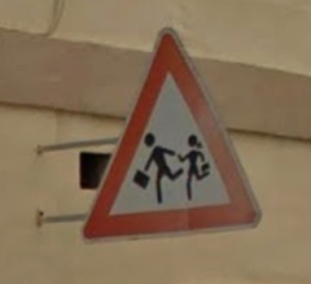

<!-- 表紙のページにはcoverを指定しましょう -->
<!-- _class: cover-->

<!-- 最初に_を入れて_headerとすることで、そのページだけに設定を反映させることができます（_class, _paginateも同様）。 -->
<!-- _header: ""-->

<!-- pagineteはページ数を表示するかどうかの設定です。 -->
<!-- _paginate: false-->

# スライドタイトル
## サブタイトル
### もう1行書くこともできます

2023年5月1日
内田研究室 M1 中本一輝

<!-- ページ区切りは---で表します。 -->
---

<!-- 目次用のclassです。必要ない場合は使わなくてOK -->
<!-- _class: mokuji -->

# もくじ

## 2.4 劣モジュラ最適化と多面体
- <a href="#5">2.4.1 劣モジュラ多面体と基多面体<span class="no">5</span></a>
- <a href="#10">2.4.2 基多面体の端点<span class="no">10</span></a>
- <a href="#21">2.4.3 基多面体と劣モジュラ関数最小化<span class="no">21</span></a>

※ PDFではリンクになっているので対応するページに飛ぶことができます。

---

<!-- 章の切れ目などで使うスライド -->
<!-- _class: section_title -->

<!-- header: このテーマの使い方 -->

<!-- section_titleではspanタグで囲った部分が強調されます。 -->
# <span>1</span>このテーマの使い方

---

# 基本的なMarkdownの書き方

このように文章を書くと、ひとつの段落として扱われます。このように文章を書くと、ひとつの段落として扱われます。このように文章を書くと、ひとつの段落として扱われます。

２回改行して前の文章と行を開けると、別の段落として扱われるようになります。２回改行して前の文章と行を開けると、別の段落として扱われるようになります。

文章中で
改行することもできます。

文章中で強調したい部分を`**`で囲むと**このように太字になります**。

また、`*`で囲んだ部分は、*斜体になります*。

注意：このテーマではMarkdownの機能に加えて、いくつか独自の機能を追加しています。


---

# 箇条書きとリスト

- 箇条書きはこのように書きます
    インデントすると箇条書きの中に文章を書けます。
- 箇条書きの下に
    - 更に箇条書きを入れることもできます

1. 番号付きリストは
1. このように
1. 書くことができます
1. 番号は自動で振られます

---

# 数式の入れ方

文の中に数式を入れるときは、`$`で囲って$y=f(x)$のように書きます。

数式のかたまりを入れたいときは
$$
y = f(x) \\
f(x) = ax^2 + bx +c 
$$
のように書きます。$=$の位置を揃えたいときは、
$$
\begin{aligned}
y &= f(x) \\
f(x) &= ax^2 + bx +c
\end{aligned}
$$
のようにかけます。

---

# 見出し１

## 見出し２

### 見出し３

### 見出しの中で**強調すると**、文字の色が変わります

---

# 引用とコードブロック

> We propose two types of autonomic and distributed cooperative behaviors of peers for peer-to-peer (P2P) file-sharing networks. 

> 当研究室では、機械学習の理論と応用に関する研究に取り組んでいます。研究対象は多様であり、知的好奇心のおもむくままに研究活動を進めています。

```
#include <stdio.h>

main()
{
  printf("Hello World\n");
}
```

`UchidaLab`のように、インラインでコードを入れることもできます。

コードブロックの色はclassで指定することができます（デフォルトは黒）。

---

## 白の例

<div class="code_white">

```
#include <stdio.h>

main()
{
  printf("Hello World\n");
}
```

`UchidaLab`のように、インラインでコードを入れることもできます。

</div>

デフォルトの色を変更したい場合はCSSを書き換えてください。

---

# cardの使い方

<div class="card title">

**カードのタイトル**

$$
\frac{1}{\sqrt{2\pi\sigma^2}}\exp{\left(-\frac{(x-\mu)^2}{2\sigma^2}\right)}
$$
    
</div>

<div class="card">

タイトルなしのカードの使えます。
    
</div>

<div class="card border">

枠線付きのカード。
    
</div>

<div class="card border_dotted">

点線
    
</div>

<div class="card border_dashed">

破線
    
</div>

---

# 画像の入れ方（と中央揃え）

画像はhtmlタグで入れると調整が楽です。真ん中に配置したい場合は次のように書きましょう。

<div class="h_center">

</div>

---

# 画像やcardの上下中央揃え

`v_center`を指定することで、画像やcardを、残った余白で上下方向で真ん中に配置できます。

<div class="v_center h_center">

図１ イタリアの標識
</div>

---

# 注釈（memo）の付け方

補足情報をスライド下部に配置することができます。

<div class="memo">

当研究室では、機械学習の理論と応用に関する研究に取り組んでいます。研究対象は多様であり、知的好奇心のおもむくままに研究活動を進めています。
    
</div>

---

# 左右で分けたいとき

段落やカードを左右で分けて表示したいときは、次のように書きます。

<div class="split">
<div class="split_l">

ああああああああああああああああああああああああああああああああああああああ

</div>
<div class="split_r">

いいいいいいいいいいいいいいいいいいいいいいいいいいいいいいいいいいいいいい

</div>
</div>

また、左右の幅を変更したいときは`flex-basis`を指定します。

<div class="split">
<div class="split_l" style="flex-basis: 30%;">

うううううううううううううううううううううううううううううううう

</div>
<div class="split_r" style="flex-basis: 70%;">

えええええええええええええええええええええええええええええええええええええええええええええええええええええええええええええええええええええええええ

</div>
</div>

画像と説明を横に並べたいときに便利です。

<div class="split">
<div class="split_l" style="flex-basis: 30%;">

<div class="v_center h_center">

</div>

</div>
<div class="split_r v_center" style="flex-basis: 70%;">

この標識はなんの標識なのでしょうか？
Wikipediaによると、子供注意の標識だそうです。

</div>
</div>

---

# その他の機能
`tips1`または`tips2`を使うと文字を強調することができます。

<span class="tips1">参考</span>

<span class="tips2">補足</span>

テーマによっては`tips4`以降が存在します。

<span class="tips3">注意</span>

<span class="tips4">問題</span>

---

<!-- class: fs32 -->

# 文字の大きさの変更

classで文字の大きさを変更することができます。

```
<!-- class: fs32 -->
```

`fs20`, `fs24`, `fs28`, `fs32`があります。
