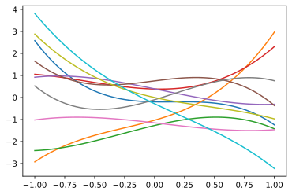
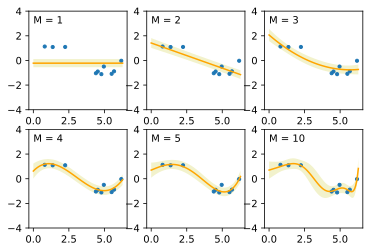
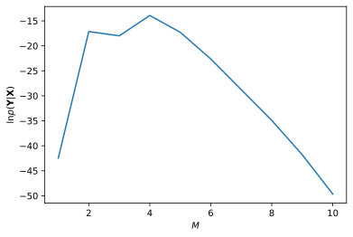
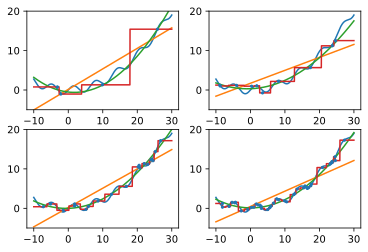
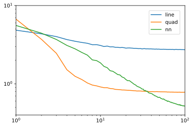

<!-- _class: cover -->
<!-- _header: "" -->
<!-- _paginate: false-->
# ベイズ推論による機械学習入門 輪講第6回
## Chapter 3.4 ~ 3.5
2021.5.27
情報理工学科 3年 中本一輝

---
<!-- _class: mokuji -->
## 目次

### <a href="#3">3.4 多次元ガウス分布の学習と予測</a>
- <a href="#6">3.4.1 平均が未知の場合6</a>
- <a href="#15">3.4.2 精度が未知の場合15</a>
- <a href="#28">3.4.3 平均・精度が未知の場合28</a>
### <a href="#46">3.5 線形回帰の例</a>
- <a href="#47">3.5.1 モデルの構築47</a>
- <a href="#49">3.5.2 事後分布と予測分布の計算49</a>
- <a href="#59">3.5.3 モデルの比較59</a>

---
<!-- _class: section_title -->
<!-- header: "3.4 多次元ガウス分布の学習と予測" -->
# 3.4多次元ガウス分布の学習と予測

---

 

**多次元ガウス分布 (multivariate Gaussian distribution)**
$$
\mathcal{N}(\mathbf{x}|\bm{\mu},\bm{\Sigma})
= \frac{1}{\sqrt{(2\pi)^D|\bm{\Sigma}|}} \exp\{-\frac{1}{2} (\mathbf{x} - \bm{\mu})^\top \bm{\Sigma}^{-1} (\mathbf{x} - \bm{\mu})\}
$$
$\bm{\mu} \in \mathbb{R}^D$は平均パラメータであり、共分散行列$\bm{\Sigma} \in \mathbb{R}^{D \times D}$は正定値行列である必要がある。

以降では１次元ガウス分布のときと同様に、共分散行列$\bm{\Sigma}$の代わりとして、その逆行列である精度行列$\bm{\Lambda} = \bm{\Sigma}^{-1}$を用いる。$\bm{\Sigma}$は対称行列であるため、その逆行列である$\bm{\Lambda}$も対称行列となる。

精度行列$\bm{\Lambda}$を使った多次元ガウス分布の対数を取ると、
$$
\ln{ \mathcal{N}(\mathbf{x}|\bm{\mu},\bm{\Lambda}^{-1}) }
= - \frac{1}{2} \{ (\mathbf{x} - \bm{\mu})^\top \bm{\Lambda} (\mathbf{x} - \bm{\mu}) + \ln{|\bm\Lambda^{-1}|} + D \ln{2\pi} \}
$$
となる。

---
$$
\ln{ \mathcal{N}(\mathbf{x}|\bm{\mu},\bm{\Lambda}^{-1}) }
= - \frac{1}{2} \{ (\mathbf{x} - \bm{\mu})^\top \bm{\Lambda} (\mathbf{x} - \bm{\mu}) + \ln{|\bm\Lambda^{-1}|} + D \ln{2\pi} \}
$$
また、この式の$\mathbf{x}$に関する部分は次のように展開できる。
$$
\begin{aligned}
(\mathbf{x} - \bm{\mu})^\top \bm{\Lambda} (\mathbf{x} - \bm{\mu})
&= \mathbf{x}^\top \bm\Lambda \mathbf{x} - \textcolor{#007bbb}{ \mathbf{x}^\top \bm\Lambda \bm\mu } - \textcolor{#007bbb}{ \bm\mu^\top \bm\Lambda \mathbf{x} } + \bm\mu^\top \bm\Lambda \bm\mu \\
&= \mathbf{x}^\top \bm\Lambda \mathbf{x} - \textcolor{#007bbb}{ 2 \mathbf{x}^\top \bm\Lambda \bm\mu } + \bm\mu^\top \bm\Lambda \bm\mu
\end{aligned}
$$

 

$\mathbf{x}^\top \bm\Lambda \bm\mu$は実数で、$\bm{\Lambda}$は対称行列だから、
$$
\mathbf{x}^\top \bm{\Lambda} \bm\mu
= (\mathbf{x}^\top \bm{\Lambda} \bm\mu)^\top
= (\bm{\Lambda} \bm\mu)^\top (\mathbf{x}^\top)^\top
= \bm\mu^\top \bm{\Lambda}^\top \mathbf{x}
= \bm\mu^\top \bm{\Lambda} \mathbf{x}
$$
となる。

---
<!-- header: "3.4.1 平均が未知の場合（事後分布の計算）" -->
# 3.4.1 平均が未知の場合
平均$\bm{\mu}$が未知で、精度行列$\bm{\Lambda}$が与えられている場合を考える。
観測モデルは次の式で表される。
$$
p(\mathbf{x}|\bm{\mu})
= \mathcal{N}(\mathbf{x}|\bm{\mu},\bm{\Lambda}^{-1})
$$
事前分布として同じガウス分布を用いる。（$\mathbf{m}$と$\bm{\Lambda}_{\bm{\mu}}$は固定された超パラメータ）
$$
p(\bm{\mu})
= \mathcal{N}(\bm{\mu}|\mathbf{m},\bm{\Lambda}_{\bm{\mu}}^{-1})
$$
すると、N個のデータ$\mathbf{X}$を観測したときの事後分布は
$$
\begin{aligned}
p(\bm{\mu}|\mathbf{X})
\propto p(\mathbf{X}|\bm{\mu}) p(\bm{\mu})
&= \{\prod_{n=1}^{N}p(\mathbf{x}_n|\bm{\mu})\} p(\bm{\mu})\\
&= \{\prod_{n=1}^{N}\mathcal{N}(\mathbf{x}_n|\bm{\mu},\bm{\Lambda}^{-1})\} \mathcal{N}(\bm{\mu}|\mathbf{m},\bm{\Lambda}_{\bm{\mu}}^{-1})
\end{aligned}
$$

---
事後分布の対数をとって$\bm\mu$について整理すると、
$$
\begin{aligned}
\ln{p(\bm{\mu}|\mathbf{X})}
&= \sum_{n=1}^{N} \ln{\mathcal{N}(\mathbf{x}_n|\bm{\mu},\bm{\Lambda}^{-1})} + \ln{\mathcal{N}(\bm{\mu}|\mathbf{m},\bm{\Lambda}_{\bm{\mu}}^{-1})} + \mathrm{const.} \\
&= - \frac{1}{2} \sum_{n=1}^{N} (\mathbf{x}_n - \bm{\mu})^\top \bm{\Lambda} (\mathbf{x}_n - \bm{\mu}) - \frac{1}{2} (\bm\mu- \mathbf{m})^\top \bm{\Lambda}_{\bm\mu} (\bm\mu - \mathbf{m}) + \mathrm{const.} \\
&= - \frac{1}{2} (\sum_{n=1}^{N} \bm\mu^\top \bm\Lambda \bm\mu - 2 \sum_{n=1}^{N} \bm\mu^\top \bm\Lambda \mathbf{x}_n) - \frac{1}{2} (\bm\mu^\top \bm{\Lambda}_{\bm\mu} \bm\mu -2 \bm\mu^\top \bm{\Lambda}_{\bm\mu} \mathbf{m}) + \mathrm{const.} \\
&= -\frac{1}{2} \{ \bm{\mu}^\top (N \bm{\Lambda} + \bm{\Lambda}_{\bm{\mu}}) \bm{\mu} - 2 \bm{\mu}^\top (\bm{\Lambda} \sum_{n=1}^{N} \mathbf{x}_n + \bm{\Lambda}_{\bm{\mu}} \mathbf{m}) \} + \mathrm{const.}
\end{aligned}
$$
のようになる。

---
事後分布もガウス分布になることがわかっているので、
$$
p(\bm{\mu}|\mathbf{X})
= \mathcal{N}(\bm{\mu}|\hat{\mathbf{m}},\hat{\bm{\Lambda}}_{\bm{\mu}}^{-1})
$$
とおいて対数を取る。
$$
\ln{p(\bm{\mu}|\mathbf{X})}
= -\frac{1}{2} \{ \bm{\mu}^\top \hat{\bm{\Lambda}}_{\bm{\mu}} \bm{\mu} - 2 \bm{\mu}^\top \hat{\bm{\Lambda}}_{\bm{\mu}} \hat{\mathbf{m}} \} + \mathrm{const.}
$$

この式と前の式を比べると
$$
\begin{aligned}
\hat{\bm{\Lambda}}_{\bm{\mu}}
&= N \bm{\Lambda} + \bm{\Lambda}_{\bm{\mu}}\\
\hat{\mathbf{m}}
&= \hat{\bm{\Lambda}}_{\bm{\mu}}^{-1} (\bm{\Lambda} \sum_{n=1}^{N} \mathbf{x}_n + \bm{\Lambda}_{\bm{\mu}} \mathbf{m})
\end{aligned}
$$
となる。

１次元ガウス分布の事後分布は
$$
\begin{aligned}
\hat{\lambda}_\mu &= N \lambda + \lambda_\mu \\
\hat{m} &= \frac{\lambda \sum_{n=1}^{N} x_n + \lambda_\mu m}{\hat{\lambda}_\mu}
\end{aligned}
$$

---
<!-- header: "3.4.1 平均が未知の場合（予測分布の計算）" -->
次に観測されてないデータ$\mathbf{x}_{*}$の予測分布を計算する。
ベイズの定理から、
$$
p(\bm\mu|\mathbf{x}_{*}) = \frac{p(\mathbf{x}_{*}|\bm\mu)p(\bm\mu)}{p(\mathbf{x}_{*})}
$$
であり、$p(\mathbf{x}_{*})$について整理して対数を取ると、
$$
\ln{p(\mathbf{x}_{*})}
= \ln{p(\mathbf{x}_{*} | \bm{\mu})} - \ln{p(\bm{\mu} | \mathbf{x}_{*})} + \mathrm{const.}
$$
となる。$p(\mathbf{x}_{*} | \bm{\mu})$は１個のデータ$\mathbf{x}_{*}$を観測したときの事後分布と考えることができるので、前のスライドの式のN=1の場合を考えて、
$$
\begin{aligned}
p(\bm{\mu} | \mathbf{x}_{*})
&= \mathcal{N} (\bm{\mu} | \mathbf{m}(\mathbf{x}_{*}), (\bm{\Lambda} + \bm{\Lambda}_{\bm{\mu}})^{-1})\\
\text{ただし}  \quad \mathbf{m}(\mathbf{x}_{*})
&= (\bm{\Lambda} + \bm{\Lambda}_{\bm{\mu}})^{-1} (\bm{\Lambda} \mathbf{x}_{*} + \bm{\Lambda}_{\bm{\mu}} \mathbf{m})
\end{aligned}
$$
となる。

---
それぞれ計算すると、
$$
\begin{aligned}
\ln{p(\mathbf{x}_{*} | \bm{\mu})}
&= \ln{\mathcal{N}(\mathbf{x}_{*}|\bm{\mu},\bm{\Lambda}^{-1})} \\
&= -\frac{1}{2} (\mathbf{x}_{*} - \bm{\mu})^\top \bm{\Lambda} (\mathbf{x}_{*} - \bm{\mu}) + \mathrm{const.} \\
&= -\frac{1}{2} ( \mathbf{x}_{*}^\top \bm{\Lambda} \mathbf{x}_{*} - 2 \mathbf{x}_{*}^\top \bm{\Lambda} \bm{\mu} ) + \mathrm{const.} \\
\\
\ln {p(\bm{\mu}|\mathbf{x}_{*})}
&= \ln{ \mathcal{N} (\bm{\mu} | \mathbf{m}(\mathbf{x}_{*}), (\bm{\Lambda} + \bm{\Lambda}_{\bm{\mu}})^{-1}) } \\
&= - \frac{1}{2} (\bm{\mu} - \mathbf{m}(\mathbf{x}_{*}))^\top (\bm{\Lambda} + \bm{\Lambda}_{\bm{\mu}}) (\bm{\mu} - \mathbf{m}(\mathbf{x}_{*})) + \mathrm{const.} \\
&= - \frac{1}{2} \{ \bm{\mu} - ((\bm{\Lambda} + \bm{\Lambda}_{\bm{\mu}})^{-1} (\bm{\Lambda} \mathbf{x}_{*} + \bm{\Lambda}_{\bm{\mu}} \mathbf{m}))^\top \} \\
& \qquad\qquad (\bm{\Lambda} + \bm{\Lambda}_{\bm{\mu}}) \{ \bm{\mu} - ((\bm{\Lambda} + \bm{\Lambda}_{\bm{\mu}})^{-1} (\bm{\Lambda} \mathbf{x}_{*} + \bm{\Lambda}_{\bm{\mu}} \mathbf{m})) \} + \mathrm{const.} \\
&= - \frac{1}{2} \{ ((\bm{\Lambda} + \bm{\Lambda}_{\bm{\mu}})^{-1} \bm{\Lambda} \mathbf{x}_{*})^\top (\bm{\Lambda} + \bm{\Lambda}_{\bm{\mu}}) ((\bm{\Lambda} + \bm{\Lambda}_{\bm{\mu}})^{-1} \bm{\Lambda} \mathbf{x}_{*}) \\
& \qquad\qquad - 2 ((\bm{\Lambda} + \bm{\Lambda}_{\bm{\mu}})^{-1} \bm{\Lambda} \mathbf{x}_{*})^\top (\bm{\Lambda} + \bm{\Lambda}_{\bm{\mu}}) (\bm{\mu} - (\bm{\Lambda} + \bm{\Lambda}_{\bm{\mu}})^{-1} \bm{\Lambda}_{\bm{\mu}} \mathbf{m}) \} + \mathrm{const.}\\
&= - \frac{1}{2} \{ \mathbf{x}_{*}^\top \bm{\Lambda} (\bm{\Lambda} + \bm{\Lambda}_{\bm{\mu}})^{-1} \bm{\Lambda} \mathbf{x}_{*} - 2 \mathbf{x}_{*}^\top \bm{\Lambda} \bm{\mu} + 2 \mathbf{x}_{*}^\top  \bm{\Lambda} (\bm{\Lambda} + \bm{\Lambda}_{\bm{\mu}})^{-1} \bm{\Lambda}_{\bm{\mu}} \mathbf{m}) \} + \mathrm{const.}
\end{aligned}
$$

---
$$
\begin{aligned}
\ln{p(\mathbf{x}_{*})}
&= \ln{p(\mathbf{x}_{*} | \bm{\mu})} - \ln{p(\bm{\mu} | \mathbf{x}_{*})} + \mathrm{const.} \\
&= -\frac{1}{2} \{ \mathbf{x}_{*}^\top (\bm{\Lambda} - \bm{\Lambda} (\bm{\Lambda} + \bm{\Lambda}_{\bm{\mu}})^{-1} \bm{\Lambda}) \mathbf{x}_{*} - 2 \mathbf{x}_{*}^\top \bm{\Lambda} (\bm{\Lambda} + \bm{\Lambda}_{\bm{\mu}})^{-1} \bm{\Lambda}_{\bm{\mu}} \mathbf{m} \} + \mathrm{const.}
\end{aligned}
$$
この分布もガウス分布であるから、
$$
p(\mathbf{x}_{*}) = \mathcal{N}(\mathbf{x}_{*}|\bm\mu_{*},\bm{\Lambda}_{*}^{-1})
$$
とおくと、
$$
\begin{aligned}
\bm{\Lambda}_{*}
&= \bm{\Lambda} - \bm{\Lambda} (\bm{\Lambda} + \bm{\Lambda}_{\bm{\mu}})^{-1} \bm{\Lambda} \\ 
\bm{\mu}_{*}
&= \bm{\Lambda}_{*}^{-1} \bm{\Lambda} (\bm{\Lambda} + \bm{\Lambda}_{\bm{\mu}})^{-1} \bm{\Lambda}_{\bm{\mu}} \mathbf{m} \\
\end{aligned}
$$
となる。

---

 

**ウッドベリーの公式 (Woodbury formula)**
$$
(\mathbf{A} + \mathbf{U} \mathbf{B} \mathbf{V})^{-1}
= \mathbf{A}^{-1} - \mathbf{A}^{-1} \mathbf{U} (\mathbf{B}^{-1} + \mathbf{V} \mathbf{A}^{-1} \mathbf{U})^{-1} \mathbf{V} \mathbf{A}^{-1}
$$
$\mathbf{U}$と$\mathbf{V}$が単位行列$\mathbf{I}$のときは、
$$
(\mathbf{A} + \mathbf{B})^{-1}
= \mathbf{A}^{-1} - \mathbf{A}^{-1} (\mathbf{B}^{-1} + \mathbf{A}^{-1})^{-1} \mathbf{A}^{-1}
$$

$\bm{\Lambda}_{*}$の計算は、上の式を使うと
$$
\begin{aligned}
\bm{\Lambda}_{*}
&= \bm{\Lambda} - \bm{\Lambda} (\bm{\Lambda} + \bm{\Lambda}_{\bm{\mu}})^{-1} \bm{\Lambda} \\
&= \bm{\Lambda} - \bm{\Lambda} (\bm{\Lambda}^{-1} - \bm{\Lambda}^{-1}(\bm{\Lambda}^{-1} + \bm{\Lambda}_{\mu}^{-1} )^{-1} \bm{\Lambda}^{-1}) \bm{\Lambda} \\
&= \bm{\Lambda} -  (\bm{\Lambda} - (\bm{\Lambda}^{-1} + \bm{\Lambda}_{\mu}^{-1} )^{-1}) \\
&= (\bm{\Lambda}^{-1} + \bm{\Lambda}_{\bm{\mu}}^{-1} )^{-1} \\
\end{aligned}
$$
となる。

---

 

$$
(\mathbf{A} + \mathbf{B})^{-1}
= \mathbf{A}^{-1} - \mathbf{A}^{-1} (\mathbf{B}^{-1} + \mathbf{A}^{-1})^{-1} \mathbf{A}^{-1}
$$

$\mathbf{A}$を$\mathbf{A}^{-1}$、$\mathbf{B}$を$\mathbf{B}^{-1}$とすると
$$
\begin{aligned}
(\mathbf{A}^{-1} + \mathbf{B}^{-1})^{-1}
&= \mathbf{A} - \mathbf{A} (\mathbf{B} + \mathbf{A})^{-1} \mathbf{A} \\
&= (\mathbf{I} - \mathbf{A} (\mathbf{B} + \mathbf{A})^{-1}) \mathbf{A} \\
&= ((\mathbf{B} + \mathbf{A})(\mathbf{B} + \mathbf{A})^{-1} - \mathbf{A} (\mathbf{B} + \mathbf{A})^{-1}) \mathbf{A} \\
&= ((\mathbf{B} + \mathbf{A}) - \mathbf{A}) (\mathbf{B} + \mathbf{A})^{-1} \mathbf{A} \\
&= \mathbf{B} (\mathbf{B} + \mathbf{A})^{-1} \mathbf{A} \\
\end{aligned}
$$
$\bm{\mu}_{*}$の式の一部がこの形をしているので、$\bm{\mu}_{*}$を計算することができる。
$$
\begin{aligned}
\bm{\mu}_{*}
&= \bm{\Lambda}_{*}^{-1} \textcolor{#007bbb}{ \bm{\Lambda} (\bm{\Lambda} + \bm{\Lambda}_{\bm{\mu}})^{-1} \bm{\Lambda}_{\bm{\mu}} } \mathbf{m} \\
&= \bm{\Lambda}_{*}^{-1} \textcolor{#007bbb}{ (\bm{\Lambda}^{-1} + \bm{\Lambda}_{\bm{\mu}}^{-1} )^{-1} } \mathbf{m}\\
&= \bm{\Lambda}_{*}^{-1} \bm{\Lambda}_{*} \mathbf{m} = \mathbf{m}
\end{aligned}
$$

---
パラメータの計算結果をまとめると、予測分布は次のように書くことができる。
$$
p(\mathbf{x}_{*}) = \mathcal{N}(\mathbf{x}_{*}|\bm\mu_{*},\bm{\Lambda}_{*}^{-1})
$$
$$
\begin{aligned}
\text{ただし} \qquad \bm{\Lambda}_{*}
&= (\bm{\Lambda}^{-1} + \bm{\Lambda}_{\bm{\mu}}^{-1} )^{-1} \\
\bm{\mu}_{*}
&= \mathbf{m}
\end{aligned}
$$

また、N個のデータ$\mathbf{X}$を観測したときの予測分布$p(\mathbf{x}_* | \mathbf{X})$は、上の式のパラメーター$\bm\Lambda, \mathbf{m}$をそれぞれ事後分布のパラメータ$\hat{\bm{\Lambda}}_{\bm{\mu}}, \hat{\mathbf{m}}$に置き換えたものとなる。

$$
\begin{aligned}
\hat{\bm{\Lambda}}_{\bm{\mu}}
&= N \bm{\Lambda} + \bm{\Lambda}_{\bm{\mu}}\\
\hat{\mathbf{m}}
&= \hat{\bm{\Lambda}}_{\bm{\mu}}^{-1} (\bm{\Lambda} \sum_{n=1}^{N} \mathbf{x}_n + \bm{\Lambda}_{\bm{\mu}} \mathbf{m})
\end{aligned}
$$

---
<!-- header: "3.4.2 精度が未知の場合（事後分布の計算）" -->
# 3.4.2 精度が未知の場合
次に、平均$\bm{\mu}$がわかっていて、精度行列$\bm{\Lambda}$がわからない場合を考える。
観測モデルは、
$$
p(\mathbf{x}|\bm{\mu})
= \mathcal{N}(\mathbf{x}|\bm{\mu},\bm{\Lambda}^{-1})
$$
であり、事前分布としてウィシャート分布を用いる。
$$
p(\bm{\Lambda}) = \mathcal{W}(\bm{\Lambda}|\nu, \mathbf{W})
$$

 

**ウィシャート分布 (Wishart distribution)**
$$
\mathcal{W}(\bm{\Lambda}|\nu, \mathbf{W})
= C_{\mathcal{W}}(\nu, \mathbf{W}) |\bm{\Lambda}|^{\frac{\nu-D-1}{2}}\exp \{ -\frac{1}{2} \mathrm{Tr}(\mathbf{W}^{-1}\bm{\Lambda}) \}
$$
$\nu$は自由度で、$\nu > D-1$を満たす実数。$\mathbf{W}$は$D \times D$の正定値行列。
$C_{\mathcal{W}}(\nu, \mathbf{W})$は正規化項だが、直接計算に使わないので今は省略。

---
同様にして、N個のデータ$\mathbf{X}$を観測したときの事後分布は
$$
\begin{aligned}
p(\bm{\Lambda}|\mathbf{X})
\propto p(\mathbf{X}|\bm{\Lambda}) p(\bm{\Lambda})
&= \{\prod_{n=1}^{N}\mathcal{N}(\mathbf{x}_n|\bm{\mu}, \bm{\Lambda}^{-1})\} \mathcal{W}(\bm{\Lambda}|\nu, \mathbf{W})
\end{aligned}
$$
であり、対数を取ると
$$
\begin{aligned}
\ln{p(\bm{\Lambda}|\mathbf{X})} &= \sum_{n=1}^{N} \ln{\mathcal{N}(\mathbf{x}_n|\bm{\mu},\bm{\Lambda}^{-1})} + \ln{\mathcal{W}(\bm{\Lambda}|\nu, \mathbf{W})} + \mathrm{const.}
\end{aligned}
$$
となる。
ウィシャート分布の対数をとったものは、
$$
\ln{\mathcal{W}(\bm{\Lambda}|\nu, \mathbf{W})}
= \frac{\nu-D-1}{2} \ln{|\bm{\Lambda}|} - \frac{1}{2} \mathrm{Tr}(\mathbf{W}^{-1}\bm{\Lambda}) + \mathrm{const.}
$$
である。

---

$\bm{x} = (x_1, x_2, \cdots, x_n)^\top, A = [a_{ij}] \in \mathbb{R}^{n \times n}$とすると、
$$
\begin{aligned}
\bm{x}^\top A \bm{x}
&= \begin{bmatrix} x_1 & x_2 & \cdots & x_n \end{bmatrix}
\begin{bmatrix}
a_{11} & a_{12} & \cdots & a_{1n} \\
a_{21} & a_{22} & \cdots & a_{2n} \\
\vdots & \vdots & \ddots & \vdots \\
a_{n1} & a_{n2} & \cdots & a_{nn}
\end{bmatrix}
\begin{bmatrix}
x_1 \\ x_2 \\ \vdots \\ x_n
\end{bmatrix} \\
&= \begin{bmatrix} \sum_{i=1}^n x_i a_{i1} & \sum_{i=1}^{n} x_i a_{i2} & \cdots & \sum_{i=1}^{n} x_i a_{in} \end{bmatrix}
\begin{bmatrix}
x_1 \\ x_2 \\ \vdots \\ x_n
\end{bmatrix} \\
&= \sum_{j=1}^n \sum_{i=1}^n x_i a_{ij} x_j
\end{aligned}
$$

---

$$
\begin{aligned}
\bm{x} \bm{x}^\top A
&= 
\begin{bmatrix}
x_1 \\ x_2 \\ \vdots \\ x_n
\end{bmatrix}
\begin{bmatrix} x_1 & x_2 & \cdots & x_n \end{bmatrix}
\begin{bmatrix}
a_{11} & a_{12} & \cdots & a_{1n} \\
a_{21} & a_{22} & \cdots & a_{2n} \\
\vdots & \vdots & \ddots & \vdots \\
a_{n1} & a_{n2} & \cdots & a_{nn}
\end{bmatrix} \\
&=
\begin{bmatrix}
x_{1}^2 & x_{1} x_{2} & \cdots & x_{1} x_{n} \\
x_{2} x_{1} & x_{2}^2 & \cdots & x_{2} x_{n} \\
\vdots & \vdots & \ddots & \vdots \\
x_{n} x_{1} & x_{n} x_{2} & \cdots & x_{n}^2 \\
\end{bmatrix}
\begin{bmatrix}
a_{11} & a_{12} & \cdots & a_{1n} \\
a_{21} & a_{22} & \cdots & a_{2n} \\
\vdots & \vdots & \ddots & \vdots \\
a_{n1} & a_{n2} & \cdots & a_{nn}
\end{bmatrix} \\
&= 
\begin{bmatrix}
\sum_{i=1}^n x_{1} x_{i} a_{i1} & \sum_{i=1}^n x_{1} x_{i} a_{i2} & \cdots & \sum_{i=1}^n x_{1} x_{i} a_{in} \\
\sum_{i=1}^n x_{2} x_{i} a_{i1} & \sum_{i=1}^n x_{2} x_{i} a_{i2} & \cdots & \sum_{i=1}^n x_{2} x_{i} a_{in} \\
\vdots & \vdots & \ddots & \vdots \\
\sum_{i=1}^n x_{n} x_{i} a_{i1} & \sum_{i=1}^n x_{n} x_{i} a_{i2} & \cdots & \sum_{i=1}^n x_{n} x_{i} a_{in} \\
\end{bmatrix}
\end{aligned}
$$

---

$\bm{x} \bm{x}^\top A$の対角成分の和は、
$$
\mathrm{Tr}(\bm{x} \bm{x}^\top A)
= \sum_{j=1}^n \sum_{i=1}^n x_j x_i a_{ij}
$$
となり、したがって、
$$
\bm{x}^\top A \bm{x} = \mathrm{Tr}(\bm{x} \bm{x}^\top A)
$$
が成り立つ。

この式を利用すると、$\ln{\mathcal{N}(\mathbf{x}_n|\bm{\mu},\bm{\Lambda}^{-1})}$は次のように表せる。
$$
\begin{aligned}
\ln{\mathcal{N}(\mathbf{x}_n|\bm{\mu},\bm{\Lambda}^{-1})}
&= - \frac{1}{2} \{ (\mathbf{x}_n - \bm{\mu})^\top \bm{\Lambda} (\mathbf{x}_n - \bm{\mu}) + \ln{|\bm{\Lambda}^{-1}|} \} + \mathrm{const.} \\
&= - \frac{1}{2} \{ \mathrm{Tr}((\mathbf{x}_n - \bm{\mu}) (\mathbf{x}_n - \bm{\mu})^\top \bm{\Lambda} ) - \ln{|\bm{\Lambda}|} \} + \mathrm{const.}
\end{aligned}
$$

---

 

$$
\begin{aligned}
\ln{\mathcal{N}(\mathbf{x}_n|\bm{\mu},\bm{\Lambda}^{-1})}
&= - \frac{1}{2} \{ \mathrm{Tr}((\mathbf{x}_n - \bm{\mu}) (\mathbf{x}_n - \bm{\mu})^\top \bm{\Lambda} ) - \ln{|\bm{\Lambda}|} \} + \mathrm{const.} \\
\ln{\mathcal{W}(\bm{\Lambda}|\nu, \mathbf{W})}
&= \frac{\nu-D-1}{2} \ln{|\bm{\Lambda}|} - \frac{1}{2} \mathrm{Tr}(\mathbf{W}^{-1}\bm{\Lambda}) + \mathrm{const.} \\
\end{aligned}
$$

よって、
$$
\begin{aligned}
\ln{p(\bm{\Lambda}|\mathbf{X})} 
&= \sum_{n=1}^{N} \ln{\mathcal{N}(\mathbf{x}_n|\bm{\mu},\bm{\Lambda}^{-1})} + \ln{\mathcal{W}(\bm{\Lambda}|\nu, \mathbf{W})} + \mathrm{const.} \\
&= \frac{N+\nu-D-1}{2} \ln{|\bm{\Lambda}|} \\
&- \frac{1}{2} \mathrm{Tr}[ \{ \sum_{n=1}^{N} (\mathbf{x}_n - \bm{\mu}) (\mathbf{x}_n - \bm{\mu})^\top + \mathbf{W}^{-1} \}\bm{\Lambda} ] + \mathrm{const.} 
\end{aligned}
$$
となる。

---
この式はウィシャート分布の形をしているので
$$
p(\bm{\Lambda}|\mathbf{X})
= \mathcal{W}(\bm\Lambda|\hat{\nu}, \hat{\mathbf{W}})
$$
$$
\begin{aligned}
\text{ただし} \quad \hat{\mathbf{W}}^{-1} &= \sum_{n=1}^{N} (\mathbf{x}_n - \bm{\mu}) (\mathbf{x}_n - \bm{\mu})^\top + \mathbf{W}^{-1} \\
\hat{\nu} &= N + \nu
\end{aligned}
$$
と表すことができる。

---
<!-- header: "3.4.2 精度が未知の場合（予測分布の計算）" -->
次に観測されてないデータ$\mathbf{x}_{*}$の予測分布を計算する。
ベイズの定理から、
$$
p(\bm{\Lambda}|\mathbf{x}_{*}) = \frac{p(\mathbf{x}_{*}|\bm{\Lambda})p(\bm{\Lambda})}{p(\mathbf{x}_{*})}
$$
であり、$p(\mathbf{x}_{*})$について整理して対数を取ると、
$$
\ln{p(\mathbf{x}_{*})}
= \ln{p(\mathbf{x}_{*} | \bm{\Lambda})} - \ln{p(\bm{\Lambda} | \mathbf{x}_{*})} + \mathrm{const.}
$$
となる。$p(\bm{\Lambda} | \mathbf{x}_{*})$は１個のデータ$\mathbf{x}_{*}$を観測したときの事後分布と考えることができ、
$$
\begin{aligned}
p(\bm{\Lambda} | \mathbf{x}_{*})
&= \mathcal{W} (\bm{\Lambda} | 1+\nu, \mathbf{W}(\mathbf{x}_{*}))\\
\text{ただし} \quad \mathbf{W}(\mathbf{x}_{*})^{-1}
&= (\mathbf{x}_* - \bm{\mu}) (\mathbf{x}_* - \bm{\mu})^\top + \mathbf{W}^{-1}
\end{aligned}
$$
となる。

---
$$
\begin{aligned}
\ln{p(\bm{\Lambda} | \mathbf{x}_{*})}
&= \ln{\mathcal{W} (\bm{\Lambda} | 1+\nu, \mathbf{W}(\mathbf{x}_{*}))} \\
&= \frac{\nu-D}{2} \ln{|\bm{\Lambda}|} - \frac{1}{2} \mathrm{Tr}({\mathbf{W}(\mathbf{x}_{*})}^{-1}\bm{\Lambda}) + \ln{C_\mathcal{W}(1+\nu,\mathbf{W}(\mathbf{x}_{*}))} \\
&= - \frac{1}{2} \mathrm{Tr}[ \{ (\mathbf{x}_* - \bm{\mu}) (\mathbf{x}_* - \bm{\mu})^\top + \mathbf{W}^{-1} \}\bm{\Lambda} ] \\
& \qquad\qquad + \frac{1+\nu}{2} \ln{|  (\mathbf{x}_* - \bm{\mu}) (\mathbf{x}_* - \bm{\mu})^\top + \mathbf{W}^{-1} |} + \mathrm{const.}
\end{aligned}
$$

 

**ウィシャート分布 (Wishart distribution)**
$$
\mathcal{W}(\bm{\Lambda}|\nu, \mathbf{W})
= C_{\mathcal{W}}(\nu, \mathbf{W}) |\bm{\Lambda}|^{\frac{\nu-D-1}{2}}\exp \{ -\frac{1}{2} \mathrm{Tr}(\mathbf{W}^{-1}\bm{\Lambda}) \}
$$
正規化項$C_{\mathcal{W}}(\nu, \mathbf{W})$を対数で書くと、
$$
\ln{ C_{\mathcal{W}}(\nu, \mathbf{W}) }
= - \frac{\nu}{2} \ln|\mathbf{W}| - \frac{\nu D}{2} \ln{2} - \frac{D(D-1)}{4} \ln{\pi} - \sum_{d=1}^{D} \ln{\Gamma(\frac{\nu+1-d}{2})}
$$

---

**行列式の性質**

$C,D \in \mathbb{R}^{N \times M}$とすると
$$
|\mathbf{I}_N + \mathbf{C}\mathbf{D}^\top| = |\mathbf{I}_M + \mathbf{C}^\top\mathbf{D}|
$$
が成り立つ。

**証明**
$
\mathrm{det}
\begin{pmatrix}
\mathbf{I}_M & -\mathbf{D}^\top \\
\mathbf{C} & \mathbf{I}_N
\end{pmatrix}
$を２つの方法で計算する。
$$
\begin{aligned}
\mathrm{det}
\begin{pmatrix}
\mathbf{I}_M & -\mathbf{D}^\top \\
\mathbf{C} & \mathbf{I}_N
\end{pmatrix}
&=
\mathrm{det}
\begin{pmatrix}
\mathbf{I}_M & -\mathbf{D}^\top \\
\mathbf{C} & \mathbf{I}_N
\end{pmatrix}
\mathrm{det}
\begin{pmatrix}
\mathbf{I}_M & \mathbf{D}^\top\\
O & \mathbf{I}_N
\end{pmatrix} \\
&=
\mathrm{det}
\begin{pmatrix}
\mathbf{I}_M & O \\
\mathbf{C} & \mathbf{I}_N + \mathbf{C}\mathbf{D}^\top
\end{pmatrix} \\
&= |\mathbf{I}_N + \mathbf{C}\mathbf{D}^\top|
\end{aligned}
$$

---

$$
\begin{aligned}
\mathrm{det}
\begin{pmatrix}
\mathbf{I}_M & -\mathbf{D}^\top \\
\mathbf{C} & \mathbf{I}_N
\end{pmatrix}
&=
\mathrm{det}
\begin{pmatrix}
\mathbf{I}_M & \mathbf{D}^\top\\
O & \mathbf{I}_N
\end{pmatrix}
\mathrm{det}
\begin{pmatrix}
\mathbf{I}_M & -\mathbf{D}^\top \\
\mathbf{C} & \mathbf{I}_N
\end{pmatrix} \\
&=
\mathrm{det}
\begin{pmatrix}
\mathbf{I}_M + \mathbf{D}^\top\mathbf{C}  & O \\
\mathbf{C} & \mathbf{I}_N
\end{pmatrix} \\
&= |\mathbf{I}_M + \mathbf{D}^\top\mathbf{C}| \\
&= |(\mathbf{I}_M + \mathbf{D}^\top\mathbf{C})^\top| \\
&= |\mathbf{I}_M + \mathbf{C}^\top\mathbf{D}|
\end{aligned}
$$

この性質を用いることで、
$$
\begin{aligned}
\ln{|(\mathbf{x}_* - \bm{\mu}) (\mathbf{x}_* - \bm{\mu})^\top + \mathbf{W}^{-1}|}
&= \ln{|\mathbf{W}^{-1}||\mathbf{I}_D + \mathbf{W}(\mathbf{x}_* - \bm{\mu}) (\mathbf{x}_* - \bm{\mu})^\top|} \\
&= \ln{|\mathbf{W}^{-1}|} + \ln{|\mathbf{I}_1 + (\mathbf{W}(\mathbf{x}_* - \bm{\mu}))^\top (\mathbf{x}_* - \bm{\mu})|} \\
&= \ln{|1 + (\mathbf{x}_* - \bm{\mu})^\top \mathbf{W}^\top (\mathbf{x}_* - \bm{\mu})|} + \mathrm{const.}\\
&= \ln{ \{ 1 + (\mathbf{x}_* - \bm{\mu})^\top \mathbf{W}(\mathbf{x}_* - \bm{\mu})\} }  + \mathrm{const.}
\end{aligned}
$$

---
よって予測分布は、
$$
\begin{aligned}
\ln{p(\mathbf{x}_{*})}
&= \ln{p(\mathbf{x}_{*} | \bm{\Lambda})} - \ln{p(\bm{\Lambda} | \mathbf{x}_{*})} + \mathrm{const.} \\
&= - \frac{1}{2} (\mathbf{x}_* - \bm{\mu})^\top \mathbf{\Lambda}(\mathbf{x}_* - \bm{\mu})
+ \frac{1}{2} \mathrm{Tr}[ \{ (\mathbf{x}_* - \bm{\mu}) (\mathbf{x}_* - \bm{\mu})^\top + \mathbf{W}^{-1} \}\bm{\Lambda} ] \\
& \qquad\qquad - \frac{1+\nu}{2} \ln{|  (\mathbf{x}_* - \bm{\mu}) (\mathbf{x}_* - \bm{\mu})^\top + \mathbf{W}^{-1} |} + \mathrm{const.} \\
&= - \frac{1}{2} \mathrm{Tr}((\mathbf{x}_* - \bm{\mu}) (\mathbf{x}_* - \bm{\mu})^\top \bm{\Lambda})
+ \frac{1}{2} \mathrm{Tr}((\mathbf{x}_* - \bm{\mu}) (\mathbf{x}_* - \bm{\mu})^\top \bm{\Lambda}) + \mathrm{Tr}(\mathbf{W}^{-1} \bm{\Lambda}) \\
& \qquad\qquad - \frac{1+\nu}{2} \ln{\{ 1 + (\mathbf{x}_* - \bm{\mu})^\top \mathbf{W}(\mathbf{x}_* - \bm{\mu})\}} + \mathrm{const.} \\
&= - \frac{1+\nu}{2} \ln{\{ 1 + (\mathbf{x}_* - \bm{\mu})^\top \mathbf{W}(\mathbf{x}_* - \bm{\mu})\}} + \mathrm{const.}
\end{aligned}
$$

$$
\ln{p(\bm{\Lambda} | \mathbf{x}_{*})}
= - \frac{1}{2} \mathrm{Tr}[ \{ (\mathbf{x}_* - \bm{\mu}) (\mathbf{x}_* - \bm{\mu})^\top + \mathbf{W}^{-1} \}\bm{\Lambda} ] + \frac{1+\nu}{2} \ln{|  (\mathbf{x}_* - \bm{\mu}) (\mathbf{x}_* - \bm{\mu})^\top + \mathbf{W}^{-1} |} + \mathrm{const.} \\
\ln{|(\mathbf{x}_* - \bm{\mu}) (\mathbf{x}_* - \bm{\mu})^\top + \mathbf{W}^{-1}|}
= \ln{ \{ 1 + (\mathbf{x}_* - \bm{\mu})^\top \mathbf{W}(\mathbf{x}_* - \bm{\mu})\} }  + \mathrm{const.}
$$

---

 

**スチューデントのt分布 (Student's t distribution)**
$$
\mathrm{St} (\mathbf{x} | \bm{\mu}_{s}, \bm{\Lambda}_{s}, \nu_{s})
= \frac{\Gamma (\frac{\nu_{s} + D}{2})}{\Gamma (\frac{\nu_{s}}{2})} \frac{|\bm{\Lambda}_{s}|^{\frac{1}{2}}}{(\pi \nu_{s})^{\frac{D}{2}}} \left\{ 1+ \frac{1}{\nu_{s}} (\mathbf{x} - \bm{\mu}_{s})^\top \bm{\Lambda}_{s} (\mathbf{x} - \bm{\mu}_{s}) \right\}^{- \frac{\nu_{s} + D}{2}}
$$
パラメータは $\bm{\mu}_s \in \mathbb{R}^D$、正定値行列$\bm\Lambda_s \in \mathbb{R}^{D \times D}$および$\nu_s \in \mathbb{R}$である。
対数をとって$\mathbf{x}$に関わる項のみを書くと、
$$
\ln{\mathrm{St} (\mathbf{x} | \bm{\mu}_{s}, \bm{\Lambda}_{s}, \nu_{s})}
= - \frac{\nu_{s} + D}{2} \ln{\left\{ 1+ \frac{1}{\nu_{s}} (\mathbf{x} - \bm{\mu}_{s})^\top \bm{\Lambda}_{s} (\mathbf{x} - \bm{\mu}_{s}) \right\}} + \mathrm{const.}
$$

上の式と計算結果を比べると、予測分布は次のように書くことができる。
$$
\begin{aligned}
p(\mathbf{x}_*)
&= \mathrm{St} (\mathbf{x}_* | \bm{\mu}_{s}, \bm{\Lambda}_{s}, \nu_{s})
\end{aligned}
$$
$$
\text{ただし} \quad \bm{\mu}_{s} = \bm{\mu},\quad
\bm{\Lambda}_{s} = (1-D+\nu) \mathbf{W},\quad
\nu_s = 1-D + \nu
$$
学習後の予測分布$p(\mathbf{x}_* | \mathbf{X})$は前と同様に、パラメータを事後分布のものに置き換えれば良い。

---
<!-- header: "3.4.3 平均・精度が未知の場合（事後分布の計算）" -->
### 3.4.3 平均・精度が未知の場合
最後に、平均と精度の両方がわからない場合を考える。
観測モデルは、
$$
p(\mathbf{x}|\bm\mu, \bm\Lambda)
= \mathcal{N}(\mathbf{x}|\bm\mu, \bm\Lambda^{-1})
$$
であり、事前分布としてガウス・ウィシャート分布を用いることで、事後分布が同じ形となる。
$$
p(\bm\mu, \bm\Lambda) = \mathrm{NW}(\bm\mu, \bm\Lambda | \mathbf{m}, \beta, \nu, \mathbf{W})
$$

**ガウス・ウィシャート分布 (Gaussian-Wishart distribution)**
$$
\mathrm{NW}(\bm\mu, \bm\Lambda | \mathbf{m}, \beta, \nu, \mathbf{W})
= \mathcal{N}(\bm\mu | \mathbf{m}, (\beta \bm\Lambda)^{-1}) \mathcal{W} (\bm\Lambda | \nu, \mathbf{W})
$$

---
<!-- header: "3.4.3 平均・精度が未知の場合（平均の事後分布の計算）" -->
まずは、データ$\mathbf{X}$を観測したときの事後分布を考える。事後分布はベイズの定理を使うと、
$$
p(\bm\mu, \bm\Lambda | \mathbf{X})
= \frac{p(\mathbf{X}|\bm\mu, \bm\Lambda) p(\bm\mu, \bm\Lambda)}{p(\mathbf{X})}
$$
と書くことができる。$\bm\mu$と$\bm\Lambda$の事後分布は条件付き分布の定義から、
$$
p(\bm\mu, \bm\Lambda | \mathbf{X})
= p(\bm\mu | \bm\Lambda, \mathbf{X}) p(\bm\Lambda | \mathbf{X})
$$
と分解できるので、最初に$\bm\mu$の事後分布を求めてから$\bm\Lambda$の事後分布を求める。
$\bm\mu$の事後分布は、$\bm\mu$に関する項だけを考えると、
$$
\begin{aligned}
p(\bm\mu | \bm\Lambda, \mathbf{X})
&= \frac{p(\bm\mu, \bm\Lambda | \mathbf{X})}{p(\bm\Lambda | \mathbf{X})} \\
&= \frac{p(\mathbf{X}|\bm\mu, \bm\Lambda) p(\bm\mu, \bm\Lambda)}{p(\mathbf{X}) p(\bm\Lambda | \mathbf{X})} \\
&\propto \{\prod_{n=1}^{N}\mathcal{N}(\mathbf{x}_n|\bm{\mu},\bm{\Lambda}^{-1})\} 
\mathrm{NW}(\bm\mu, \bm\Lambda | \mathbf{m}, \beta, \nu, \mathbf{W})
\end{aligned}
$$

---
$$
\begin{aligned}
p(\bm\mu | \bm\Lambda, \mathbf{X})
&\propto \{\prod_{n=1}^{N}\mathcal{N}(\mathbf{x}_n|\bm{\mu},\bm{\Lambda}^{-1})\} 
\mathrm{NW}(\bm\mu, \bm\Lambda | \mathbf{m}, \beta, \nu, \mathbf{W}) \\
&= \{\prod_{n=1}^{N}\mathcal{N}(\mathbf{x}_n|\bm{\mu},\bm{\Lambda}^{-1})\} 
\mathcal{N}(\bm\mu | \mathbf{m}, (\beta \bm\Lambda)^{-1}) \mathcal{W} (\bm\Lambda | \nu, \mathbf{W}) \\
&\propto \{\prod_{n=1}^{N}\mathcal{N}(\mathbf{x}_n|\bm{\mu},\bm{\Lambda}^{-1})\} 
\mathcal{N}(\bm\mu | \mathbf{m}, (\beta \bm\Lambda)^{-1})
\end{aligned}
$$
この式は、平均が未知の場合の事後分布の式の精度行列を$\beta\bm\Lambda$に置き換えたものになっているので、

$$
p(\bm\mu | \bm\Lambda, \mathbf{X})
= \mathcal{N}(\bm{\mu}|\hat{\mathbf{m}},(\hat\beta \bm\Lambda)^{-1})
$$
$$
\begin{aligned}
\text{ただし} \quad \hat\beta &= N + \beta\\
\hat{\mathbf{m}} &= \frac{1}{\hat\beta} (\sum_{n=1}^{N} \mathbf{x}_n + \beta \mathbf{m})
\end{aligned}
$$

平均が未知の場合：
$$
\begin{aligned}
\hat{\bm{\Lambda}}_{\bm{\mu}}
&= N \bm{\Lambda} + \bm{\Lambda}_{\bm{\mu}}\\
\hat{\mathbf{m}}
&= \hat{\bm{\Lambda}}_{\bm{\mu}}^{-1} (\bm{\Lambda} \textstyle\sum_{n=1}^{N} \mathbf{x}_n + \bm{\Lambda}_{\bm{\mu}} \mathbf{m})
\end{aligned}
$$

---
<!-- header: "3.4.3 平均・精度が未知の場合（精度の事後分布の計算）" -->
次に、$\bm\Lambda$の事後分布$p(\bm\Lambda | \mathbf{X})$を求める。
$$
\begin{aligned}
p(\bm\Lambda | \mathbf{X})
&= \frac{p(\mathbf{X}|\bm\mu, \bm\Lambda) p(\bm\mu, \bm\Lambda)}{p(\mathbf{X}) p(\bm\mu | \bm\Lambda, \mathbf{X})} \\
&\propto \frac{\{\prod_{n=1}^{N}\mathcal{N}(\mathbf{x}_n|\bm{\mu},\bm{\Lambda}^{-1})\} 
\mathcal{N}(\bm\mu | \mathbf{m}, (\beta \bm\Lambda)^{-1}) \mathcal{W} (\bm\Lambda | \nu, \mathbf{W})}{\mathcal{N}(\bm{\mu}|\hat{\mathbf{m}},(\hat\beta \bm\Lambda)^{-1})}
\end{aligned}
$$
事後分布の対数を取ると、
$$
\ln{p(\bm\Lambda | \mathbf{X})}
= \ln{p(\mathbf{X}|\bm\mu, \bm\Lambda)} + \ln{p(\bm\mu, \bm\Lambda)} - \ln{p(\bm\mu | \bm\Lambda, \mathbf{X})} + \mathrm{const.}
$$
となる。
$$
\begin{aligned}
\ln{p(\bm\Lambda | \mathbf{X})} 
&= \sum_{n=1}^{N} \ln{\mathcal{N}(\mathbf{x}_n|\bm{\mu},\bm{\Lambda}^{-1})} + \ln{\mathcal{N}(\bm\mu | \mathbf{m}, (\beta \bm\Lambda)^{-1})} \\
& \qquad\qquad + \ln{\mathcal{W} (\bm\Lambda | \nu, \mathbf{W})} - \ln{\mathcal{N}(\bm{\mu}|\hat{\mathbf{m}},(\hat\beta \bm\Lambda)^{-1})} + \mathrm{const.}
\end{aligned}
$$

---
それぞれ計算してみると、
$$
\begin{aligned}
\sum_{n=1}^{N} \ln{\mathcal{N}(\mathbf{x}_n|\bm{\mu},\bm{\Lambda}^{-1})}
&= \sum_{n=1}^{N} - \frac{1}{2} \{ (\mathbf{x}_n - \bm{\mu})^\top \bm{\Lambda} (\mathbf{x}_n - \bm{\mu}) + \ln{|\bm{\Lambda}^{-1}|} \} + \mathrm{const.} \\
&= - \frac{1}{2} \{ \sum_{n=1}^{N} \mathbf{x}_n^\top \bm{\Lambda} \mathbf{x}_n - 2 \sum_{n=1}^{N} \mathbf{x}_n^\top \bm{\Lambda} \bm\mu + N \bm\mu^\top \bm{\Lambda} \bm\mu - N \ln{|\bm\Lambda|}\} + \mathrm{const.}
\\\\
\ln{\mathcal{N}(\bm\mu | \mathbf{m}, (\beta \bm\Lambda)^{-1})}
&= - \frac{1}{2} \{ \bm\mu^\top (\beta \bm{\Lambda}) \bm\mu - 2 \mathbf{m}^\top (\beta \bm{\Lambda}) \bm\mu + \mathbf{m}^\top (\beta \bm{\Lambda}) \mathbf{m} - \ln{|\beta \bm{\Lambda}|}\} + \mathrm{const.} \\
&= - \frac{1}{2} \{ \beta \bm\mu^\top \bm{\Lambda} \bm\mu - 2 \beta \mathbf{m}^\top \bm{\Lambda} \bm\mu + \beta \mathbf{m}^\top \bm{\Lambda} \mathbf{m} - \ln{\beta^D} - \ln{|\bm{\Lambda}|}\} + \mathrm{const.}
\end{aligned}
$$

$$
\ln{|\bm{\Lambda}^{-1}|} = \ln{|\bm{\Lambda}|^{-1}} = - \ln{|\bm{\Lambda}|}
$$
$$
\ln{|\beta \bm{\Lambda}|} = \ln{(\beta^D |\bm{\Lambda}|)} = \ln{\beta^D} + \ln{|\bm{\Lambda}|}
$$

---
$$
\begin{aligned}
\ln{\mathcal{W} (\bm\Lambda | \nu, \mathbf{W})}
&= \frac{\nu-D-1}{2} \ln{|\bm{\Lambda}|} - \frac{1}{2} \mathrm{Tr}(\mathbf{W}^{-1}\bm{\Lambda}) + \mathrm{const.} \\\\
\ln{\mathcal{N}(\bm{\mu}|\hat{\mathbf{m}},(\hat\beta \bm\Lambda)^{-1})}
&= - \frac{1}{2} \{ \hat\beta \bm\mu^\top \bm{\Lambda} \bm\mu - 2 \hat\beta \hat{\mathbf{m}}^\top \bm{\Lambda} \bm\mu + \hat\beta \hat{\mathbf{m}}^\top \bm{\Lambda} \hat{\mathbf{m}} -\ln{\hat\beta^D} - \ln{|\bm{\Lambda}|}\} + \mathrm{const.} \\
&= - \frac{1}{2} \{ (N+\beta) \bm\mu^\top \bm{\Lambda} \bm\mu - 2 (\sum_{n=1}^{N} \mathbf{x}_n + \beta \mathbf{m})^\top \bm{\Lambda} \bm\mu \\
& \qquad\qquad + \hat\beta \hat{\mathbf{m}} ^\top \bm{\Lambda} \hat{\mathbf{m}}  -\ln{\hat\beta^D} - \ln{|\bm{\Lambda}|}\} + \mathrm{const.} 
\end{aligned}
$$

$$
\hat\beta = N + \beta, \qquad \hat{\mathbf{m}} = \frac{1}{\hat\beta} (\sum_{n=1}^{N} \mathbf{x}_n + \beta \mathbf{m})
$$

---
$$
\begin{aligned}
\ln{p(\bm\Lambda | \mathbf{X})} 
&= \sum_{n=1}^{N} \ln{\mathcal{N}(\mathbf{x}_n|\bm{\mu},\bm{\Lambda}^{-1})} + \ln{\mathcal{N}(\bm\mu | \mathbf{m}, (\beta \bm\Lambda)^{-1})} \\
& \qquad\qquad + \ln{\mathcal{W} (\bm\Lambda | \nu, \mathbf{W})} - \ln{\mathcal{N}(\bm{\mu}|\hat{\mathbf{m}},(\hat\beta \bm\Lambda)^{-1})} + \mathrm{const.} \\
&= - \frac{1}{2} \{ \sum_{n=1}^{N} \mathbf{x}_n^\top \bm{\Lambda} \mathbf{x}_n + \beta \mathbf{m}^\top \bm{\Lambda} \mathbf{m} - \hat\beta \hat{\mathbf{m}}^\top \bm{\Lambda} \hat{\mathbf{m}} \} + \frac{N}{2} \ln{|\bm\Lambda|} \\
& \qquad\qquad + \frac{\nu-D-1}{2} \ln{|\bm{\Lambda}|} - \frac{1}{2} \mathrm{Tr}(\mathbf{W}^{-1}\bm{\Lambda}) + \mathrm{const.} \\
&= - \frac{1}{2} \mathrm{Tr}[ \{ \sum_{n=1}^{N} \mathbf{x}_n \mathbf{x}_n^\top + \beta \mathbf{m} \mathbf{m}^\top - \hat\beta \hat{\mathbf{m}} \hat{\mathbf{m}}^\top + \mathbf{W}^{-1} \} \bm{\Lambda} ] \\
& \qquad\qquad + \frac{N+\nu-D-1}{2} \ln{|\bm{\Lambda}|} + \mathrm{const.} \\
\end{aligned}
$$

---
$$
\begin{aligned}
\ln{p(\bm\Lambda | \mathbf{X})}
&= - \frac{1}{2} \mathrm{Tr}[ \{ \sum_{n=1}^{N} \mathbf{x}_n \mathbf{x}_n^\top + \beta \mathbf{m} \mathbf{m}^\top - \hat\beta \hat{\mathbf{m}} \hat{\mathbf{m}}^\top + \mathbf{W}^{-1} \} \bm{\Lambda} ] \\
& \qquad\qquad + \frac{N+\nu-D-1}{2} \ln{|\bm{\Lambda}|} + \mathrm{const.} \\
\end{aligned}
$$
これはウィシャート分布の形をしているので、定義式と対応関係を調べれば、
$$
p(\bm\Lambda | \mathbf{X})
= \mathcal{W}(\bm\Lambda | \hat\nu, \hat{\mathbf{W}})
$$
$$
\begin{aligned}
\text{ただし} \quad \hat{\mathbf{W}}^{-1}
&= \sum_{n=1}^{N} \mathbf{x}_n \mathbf{x}_n^\top + \beta \mathbf{m} \mathbf{m}^\top - \hat\beta \hat{\mathbf{m}} \hat{\mathbf{m}}^\top + \mathbf{W}^{-1} \\
\hat\nu &=  N + \nu
\end{aligned}
$$

 

$$
\ln{\mathcal{W}(\bm{\Lambda}|\nu, \bm{\Lambda}^{-1})}
= \frac{\nu-D-1}{2} \ln{|\bm{\Lambda}|} - \frac{1}{2} \mathrm{Tr}(\mathbf{W}^{-1}\bm{\Lambda}) + \mathrm{const.}
$$

---
<!-- header: "3.4.3 平均・精度が未知の場合（予測分布の計算）" -->
最後に、観測されてないデータ$\mathbf{x}_{*}$の予測分布を計算する。
ベイズの定理から、
$$
p(\bm\mu, \bm\Lambda|\mathbf{x}_{*})
= \frac{p(\mathbf{x}_{*} | \bm\mu, \bm{\Lambda})p(\bm\mu, \bm{\Lambda})}{p(\mathbf{x}_{*})}
$$
であり、$p(\mathbf{x}_{*})$について整理して対数を取ると、
$$
\ln{p(\mathbf{x}_{*})}
= \ln{p(\mathbf{x}_{*} | \bm\mu, \bm{\Lambda})} - \ln{p(\bm\mu, \bm{\Lambda} | \mathbf{x}_{*})} + \mathrm{const.}
$$
となる。$p(\bm\mu, \bm{\Lambda} | \mathbf{x}_{*})$は１個のデータ$\mathbf{x}_{*}$を観測したときの事後分布と考えることができ、
$$
\begin{aligned}
p(\bm\mu, \bm{\Lambda} | \mathbf{x}_{*})
&= p(\bm\mu | \bm\Lambda, \mathbf{x}_{*}) p(\bm\Lambda | \mathbf{x}_{*})\\
\end{aligned}
$$
となる。

---

$$
p(\bm\mu | \bm\Lambda, \mathbf{X})
= \mathcal{N}(\bm{\mu}|\hat{\mathbf{m}},(\hat\beta \bm\Lambda)^{-1})
$$
$$
\begin{aligned}
\text{ただし} \quad \hat\beta &= N + \beta\\
\hat{\mathbf{m}} &= \frac{1}{\hat\beta} (\sum_{n=1}^{N} \mathbf{x}_n + \beta \mathbf{m})
\end{aligned}
$$

$p(\bm\mu | \bm\Lambda, \mathbf{x}_{*})$を計算すると、
$$
\begin{aligned}
p(\bm\mu | \bm\Lambda, \mathbf{x}_{*})
&= \mathcal{N}(\bm\mu | \mathbf{m}(\mathbf{x}_{*}), ((1+\beta)\bm\Lambda)^{-1}) \\
\text{ただし} \quad \mathbf{m}(\mathbf{x}_*) &= \frac{1}{1+\beta} (\mathbf{x}_{*} + \beta \mathbf{m})
\end{aligned}
$$
となる。

---

$$
p(\bm\Lambda | \mathbf{X})
= \mathcal{W}(\bm\Lambda | \hat\nu, \hat{\mathbf{W}})
$$
$$
\begin{aligned}
\text{ただし} \quad \hat{\mathbf{W}}^{-1}
&= \sum_{n=1}^{N} \mathbf{x}_n \mathbf{x}_n^\top + \beta \mathbf{m} \mathbf{m}^\top - (1+\beta) \hat{\mathbf{m}} \hat{\mathbf{m}}^\top + \mathbf{W}^{-1}\\
\hat\nu &=  N + \nu, \quad 
\hat{\mathbf{m}} = \frac{1}{1+\beta} (\sum_{n=1}^{N} \mathbf{x}_n + \beta \mathbf{m})
\end{aligned}
$$

上の式を流用して$p(\bm\Lambda | \mathbf{x}_*)$を計算すると、
$$
p(\bm\Lambda | \mathbf{x}_*)
= \mathcal{W}(\bm\Lambda | 1+\nu, \mathbf{W}(\mathbf{x}_*))
$$
$$
\begin{aligned}
\text{ただし} \quad {\mathbf{W}(\mathbf{x}_*)}^{-1}
&= \mathbf{x}_* \mathbf{x}_*^\top + \beta \mathbf{m} \mathbf{m}^\top - (1+\beta) {\mathbf{m}(\mathbf{x}_*)} {\mathbf{m}(\mathbf{x}_*)}^\top + \mathbf{W}^{-1} \\
&= \mathbf{x}_* \mathbf{x}_*^\top + \beta \mathbf{m} \mathbf{m}^\top - \frac{1}{1+\beta} ( \mathbf{x}_* + \beta \mathbf{m}) ( \mathbf{x}_* + \beta \mathbf{m})^\top + \mathbf{W}^{-1}
\end{aligned}
$$

---
$$
\begin{aligned}
{\mathbf{W}(\mathbf{x}_*)}^{-1}
&= \mathbf{x}_* \mathbf{x}_*^\top + \beta \mathbf{m} \mathbf{m}^\top - \frac{1}{1+\beta} ( \mathbf{x}_* + \beta \mathbf{m}) ( \mathbf{x}_* + \beta \mathbf{m})^\top + \mathbf{W}^{-1} \\
&= \mathbf{x}_* \mathbf{x}_*^\top + \beta \mathbf{m} \mathbf{m}^\top - \frac{1}{1+\beta} (  \mathbf{x}_* \mathbf{x}_*^\top + 2\beta \mathbf{x}_* \mathbf{m}^\top + \beta^2 \mathbf{m} \mathbf{m}^\top ) + \mathbf{W}^{-1} \\
&= \frac{\beta}{1+\beta} \mathbf{x}_* \mathbf{x}_*^\top - \frac{2 \beta}{1+\beta} \mathbf{x}_* \mathbf{m}^\top + \frac{\beta}{1+\beta} \mathbf{m} \mathbf{m}^\top + \mathbf{W}^{-1} \\
&= \frac{\beta}{1+\beta} ( \mathbf{x}_* - \mathbf{m}) ( \mathbf{x}_* - \mathbf{m})^\top + \mathbf{W}^{-1}
\end{aligned} 
$$
となる。よって$p(\bm\mu, \bm{\Lambda} | \mathbf{x}_{*})$は次のように表される。
$$
p(\bm\mu, \bm{\Lambda} | \mathbf{x}_{*})
= p(\bm\mu | \bm\Lambda, \mathbf{x}_{*}) p(\bm\Lambda | \mathbf{x}_{*})
= \mathcal{N}(\bm{\mu} | \mathbf{m}(\mathbf{x}_*),((1+\beta) \bm\Lambda)^{-1})
\mathcal{W}(\bm\Lambda | 1+\nu, \mathbf{W}(\mathbf{x}_*))
$$
$$
\begin{aligned}
\text{ただし} \qquad 
\mathbf{m}(\mathbf{x}_*) &= \frac{1}{1+\beta} (\mathbf{x}_{*} + \beta \mathbf{m}) \\
{\mathbf{W}(\mathbf{x}_*)}^{-1}
&= \frac{\beta}{1+\beta} ( \mathbf{x}_* - \mathbf{m}) ( \mathbf{x}_* - \mathbf{m})^\top + \mathbf{W}^{-1}
\end{aligned}
$$

---
これまでの結果から予測分布は、
$$
\begin{aligned}
\ln{p(\mathbf{x}_{*})}
&= \ln{p(\mathbf{x}_{*} | \bm\mu, \bm{\Lambda})} - \ln{p(\bm\mu, \bm{\Lambda} | \mathbf{x}_{*})} + \mathrm{const.} \\
&= \ln{ \mathcal{N}(\mathbf{x}_{*} | \bm\mu, \bm{\Lambda}) } - \ln{ \mathcal{N}(\bm{\mu}|\mathbf{m}(\mathbf{x}_*),((1+\beta) \bm\Lambda)^{-1}) }\\
& \qquad\qquad\qquad\qquad\qquad\qquad - \ln{ \mathcal{W}(\bm\Lambda | 1+\nu, \mathbf{W}(\mathbf{x}_*)) } + \mathrm{const.} \\
\end{aligned}
$$
となる。それぞれの確率分布の対数をとったものについて、$\mathbf{x}_{*}$に関わる項だけを考える。
$$
\begin{aligned}
\ln{ \mathcal{N}(\mathbf{x}_{*} | \bm\mu, \bm{\Lambda}) }
&= - \frac{1}{2} (\mathbf{x}_* - \bm\mu)^\top \bm\Lambda (\mathbf{x}_* - \bm\mu) + \mathrm{const.} \\
&= - \frac{1}{2} (\mathbf{x}_*^\top \bm\Lambda \mathbf{x}_* - 2 \mathbf{x}_*^\top \bm\Lambda \bm\mu) + \mathrm{const.} \\\\
\ln{ \mathcal{N}(\bm{\mu}|\mathbf{m}(\mathbf{x}_*),((1+\beta) \bm\Lambda)^{-1}) }
&= - \frac{1}{2} (\bm\mu - \mathbf{m}(\mathbf{x}_*))^\top (1+\beta) \bm\Lambda (\bm\mu - \mathbf{m}(\mathbf{x}_*)) + \mathrm{const.} \\
&= - \frac{1}{2} (1+\beta) \{ - 2\bm\mu^\top \bm\Lambda \mathbf{m}(\mathbf{x}_*) + \mathbf{m}(\mathbf{x}_*)^\top \bm\Lambda \mathbf{m}(\mathbf{x}_*) \} + \mathrm{const.} \\
\end{aligned}
$$

---
$$
\begin{aligned}
\ln{ \mathcal{N}(\bm{\mu}|\mathbf{m}(\mathbf{x}_*),((1+\beta) \bm\Lambda)^{-1}) }
&= - \frac{1}{2} (1+\beta) \{ - 2\bm\mu^\top \bm\Lambda \mathbf{m}(\mathbf{x}_*) + \mathbf{m}(\mathbf{x}_*)^\top \bm\Lambda \mathbf{m}(\mathbf{x}_*) \} + \mathrm{const.} \\
&= - \frac{1}{2} \{ - 2\bm\mu^\top \bm\Lambda (\mathbf{x}_* + \beta \mathbf{m}) \\
& \qquad\qquad + \frac{1}{1+\beta} (\mathbf{x}_* + \beta \mathbf{m})^\top \bm\Lambda (\mathbf{x}_* + \beta \mathbf{m}) \} + \mathrm{const.} \\
&= - \frac{1}{2} ( - 2\bm\mu^\top \bm\Lambda \mathbf{x}_* \\
& \qquad\qquad + \frac{1}{1+\beta} \mathbf{x}_*^\top \bm\Lambda \mathbf{x}_* + \frac{2\beta}{1+\beta} \mathbf{x}_*^\top \bm\Lambda \mathbf{m} ) + \mathrm{const.} \\
\end{aligned}
$$

$$
\mathbf{m}(\mathbf{x}_*) = \frac{1}{1+\beta} (\mathbf{x}_* + \beta \mathbf{m})
$$

---

 

$$
\mathcal{W}(\bm{\Lambda}|\nu, \mathbf{W})
= C_{\mathcal{W}}(\nu, \mathbf{W}) |\bm{\Lambda}|^{\frac{\nu-D-1}{2}}\exp \{ -\frac{1}{2} \mathrm{Tr}(\mathbf{W}^{-1}\bm{\Lambda}) \}
$$
$$
\ln{ C_{\mathcal{W}}(\nu, \mathbf{W}) }
= - \frac{\nu}{2} \ln|\mathbf{W}| - \frac{\nu D}{2} \ln{2} - \frac{D(D-1)}{4} \ln{\pi} - \sum_{d=1}^{D} \ln{\Gamma(\frac{\nu+1-d}{2})}
$$

$$
\begin{aligned}
\ln{ \mathcal{W}(\bm\Lambda | 1+\nu, \mathbf{W}(\mathbf{x}_*)) }
&= - \frac{1}{2} \mathrm{Tr}(\mathbf{W}(\mathbf{x}_*)^{-1} \bm\Lambda) - \frac{1+\nu}{2} \ln{|\mathbf{W}(\mathbf{x}_*)^{-1}|^{-1}} + \mathrm{const.} \\
&= - \frac{1}{2} \mathrm{Tr}[\{ \frac{\beta}{1+\beta} ( \mathbf{x}_* - \mathbf{m}) ( \mathbf{x}_* - \mathbf{m})^\top + \mathbf{W}^{-1} \} \bm\Lambda ] \\
& \qquad\qquad + \frac{1+\nu}{2} \ln{\left|\frac{\beta}{1+\beta} ( \mathbf{x}_* - \mathbf{m}) ( \mathbf{x}_* - \mathbf{m})^\top + \mathbf{W}^{-1}\right|} + \mathrm{const.}
\end{aligned}
$$

$$
{\mathbf{W}(\mathbf{x}_*)}^{-1}
= \frac{\beta}{1+\beta} ( \mathbf{x}_* - \mathbf{m}) ( \mathbf{x}_* - \mathbf{m})^\top + \mathbf{W}^{-1}
$$

---
$$
\begin{aligned}
\ln{ \mathcal{W}(\bm\Lambda | 1+\nu, \mathbf{W}(\mathbf{x}_*)) }
&= - \frac{1}{2} \mathrm{Tr}[\{ \frac{\beta}{1+\beta} ( \mathbf{x}_* - \mathbf{m}) ( \mathbf{x}_* - \mathbf{m})^\top + \mathbf{W}^{-1} \} \bm\Lambda ] \\
& \qquad\qquad + \frac{1+\nu}{2} \ln{\left|\frac{\beta}{1+\beta} ( \mathbf{x}_* - \mathbf{m}) ( \mathbf{x}_* - \mathbf{m})^\top + \mathbf{W}^{-1}\right|} + \mathrm{const.} \\
&= - \frac{1}{2} \frac{\beta}{1+\beta} \mathrm{Tr}(( \mathbf{x}_* - \mathbf{m}) ( \mathbf{x}_* - \mathbf{m})^\top \bm\Lambda) - \frac{1}{2} \mathrm{Tr}(\mathbf{W}^{-1} \bm\Lambda)\\
& \qquad\qquad + \frac{1+\nu}{2} \ln|\mathbf{W}^{-1}|\left|\mathbf{I}_D + \frac{\beta}{1+\beta} \mathbf{W} ( \mathbf{x}_* - \mathbf{m}) ( \mathbf{x}_* - \mathbf{m})^\top\right|  + \mathrm{const.} \\
&= - \frac{1}{2} \frac{\beta}{1+\beta} ( \mathbf{x}_* - \mathbf{m})^\top \bm\Lambda ( \mathbf{x}_* - \mathbf{m})\\
& \qquad\qquad + \frac{1+\nu}{2} \ln{\left| \mathbf{I}_1 + \frac{\beta}{1+\beta} ( \mathbf{x}_* - \mathbf{m})^\top \mathbf{W} ( \mathbf{x}_* - \mathbf{m}) \right|} + \mathrm{const.} \\
&= - \frac{1}{2} ( \frac{\beta}{1+\beta} \mathbf{x}_*^\top \bm\Lambda \mathbf{x}_* - \frac{2\beta}{1+\beta} \mathbf{x}_*^\top \bm\Lambda \mathbf{m} ) \\
& \qquad\qquad + \frac{1+\nu}{2} \ln{\{ 1 + \frac{\beta}{1+\beta} ( \mathbf{x}_* - \mathbf{m})^\top \mathbf{W} ( \mathbf{x}_* - \mathbf{m}) \}} + \mathrm{const.} \\
\end{aligned}
$$

---
以上の結果から、予測分布を計算すると、
$$
\begin{aligned}
\ln{p(\mathbf{x}_{*})}
&= \ln{ \mathcal{N}(\mathbf{x}_{*} | \bm\mu, \bm{\Lambda}) } - \ln{ \mathcal{N}(\bm{\mu}|\mathbf{m}(\mathbf{x}_*),((1+\beta) \bm\Lambda)^{-1}) }\\
& \qquad\qquad\qquad\qquad\qquad\qquad - \ln{ \mathcal{W}(\bm\Lambda | 1+\nu, \mathbf{W}(\mathbf{x}_*)) } + \mathrm{const.} \\
&= - \frac{1+\nu}{2} \ln{\{  1 + \frac{\beta}{1+\beta} ( \mathbf{x}_* - \mathbf{m})^\top \mathbf{W} ( \mathbf{x}_* - \mathbf{m}) \}} + \mathrm{const.}
\end{aligned}
$$

$$
\begin{aligned}
\ln{ \mathcal{N}(\mathbf{x}_{*} | \bm\mu, \bm{\Lambda}) }
&= - \frac{1}{2} (\mathbf{x}_*^\top \bm\Lambda \mathbf{x}_* - 2 \mathbf{x}_*^\top \bm\Lambda \bm\mu) + \mathrm{const.} \\\\
\ln{ \mathcal{N}(\bm{\mu}|\mathbf{m}(\mathbf{x}_*),((1+\beta) \bm\Lambda)^{-1}) }
&= - \frac{1}{2} ( \frac{1}{1+\beta} \mathbf{x}_*^\top \bm\Lambda \mathbf{x}_* + \frac{2\beta}{1+\beta} \mathbf{x}_*^\top \bm\Lambda \mathbf{m} - 2\mathbf{x}_*^\top \bm\Lambda \bm\mu ) + \mathrm{const.} \\\\
\ln{ \mathcal{W}(\bm\Lambda | 1+\nu, \mathbf{W}(\mathbf{x}_*)) }
&= - \frac{1}{2} ( \frac{\beta}{1+\beta} \mathbf{x}_*^\top \bm\Lambda \mathbf{x}_* - \frac{2\beta}{1+\beta} \mathbf{x}_*^\top \bm\Lambda \mathbf{m} ) \\
& \qquad\qquad + \frac{1+\nu}{2} \ln{\{ 1 + \frac{\beta}{1+\beta} ( \mathbf{x}_* - \mathbf{m})^\top \mathbf{W} ( \mathbf{x}_* - \mathbf{m}) \}} + \mathrm{const.} \\
\end{aligned}
$$

---
$$
\ln{p(\mathbf{x}_{*})}
= - \frac{1+\nu}{2} \ln{\{  1 + \frac{\beta}{1+\beta} ( \mathbf{x}_* - \mathbf{m})^\top \mathbf{W} ( \mathbf{x}_* - \mathbf{m}) \}} + \mathrm{const.}
$$
この式は多次元のスチューデントのt分布の対数をとったものと一致しているので、
$$
p(\mathbf{x}_{*})
= \mathrm{St} (\mathbf{x}_* | \bm{\mu}_{s}, \bm{\Lambda}_{s}, \nu_{s})
$$
$$
\begin{aligned}
\text{ただし} \quad \bm{\mu}_{s} &= \mathbf{m} \\
\bm{\Lambda}_{s} &= \frac{(1-D+\nu) \beta}{1+\beta} \mathbf{W}\\
\nu_s &= 1 - D + \nu
\end{aligned}
$$
となる。また、複数のデータを観測した後の予測分布$p(\mathbf{x}_* | \mathbf{X})$は、パラメータ$\beta, \mathbf{m}, \mathbf{W} ,\nu$を事後分布のパラメータに置き換えることで計算できる。

$$
\ln{\mathrm{St} (\mathbf{x} | \bm{\mu}_{s}, \bm{\Lambda}_{s}, \nu_{s})}
= - \frac{\nu_{s} + D}{2} \ln{\left\{ 1+ \frac{1}{\nu_{s}} (\mathbf{x} - \bm{\mu}_{s})^\top \bm{\Lambda}_{s} (\mathbf{x} - \bm{\mu}_{s}) \right\}} + \mathrm{const.}
$$

---
<!-- _class: section_title -->
<!-- header: "3.5 線形回帰の例" -->
# 3.5 線形回帰の例

---
<!-- header: "3.5.1 モデルの構築" -->
### 3.5.1 モデルの構築
線形回帰モデルでは、実数の出力値$y_n \in \mathbb{R}$は、入力値$\mathbf{x}_n \in \mathbb{R}^M$、パラメータ$\mathbf{w} \in \mathbb{R}^M$、ノイズ成分$\epsilon_n \in \mathbb{R}$を使って、
$$
y_n = \mathbf{w}^\top \mathbf{x}_n + \epsilon_n
$$
と表される。ノイズ成分$\epsilon_n$は平均が0で精度が$\lambda$のガウス分布に従っていると仮定する。
$$
\epsilon_n \sim \mathcal{N}(\epsilon_n | 0, \lambda^{-1})
$$
このガウス分布の精度パラメータ$\lambda$はすでに分かっているものとする。

2つの式をまとめると、$y_n$の確率分布は次のように書くことができる。
$$
p(y_n | \mathbf{x}_n, \mathbf{w}) = \mathcal{N} (y_n | \mathbf{w}^\top \mathbf{x}_n, \lambda^{-1} )
$$

---
観測データからパラメータ$\mathbf{w}$を学習したいので、事前分布$p(\mathbf{w})$にはガウス分布を用いる。
$$
p(\mathbf{w}) = \mathcal{N} (\mathbf{w}| \mathbf{m}, \bm\Lambda^{-1} )
$$
$\mathbf{m} \in \mathbb{R}^M$は平均パラメータ、正定値行列$\bm\Lambda$は精度行列パラメータであり、この2つは超パラメータである。

$M=4$とし、入力ベクトルは$(1, x, x^2, x^3)^\top$のように３次多項式を選ぶ。事前分布は、$\mathbf{m}$をゼロベクトル、$\bm\Lambda=\mathbf{I}_M$として、モデルからデータサンプルを取得すると、図3.1のようになる。また、サンプルから関数を一つ選んで人工的に生成した観測値をプロットすると図3.2のようになる。このように、モデル設計の時点でサンプルを抽出して妥当性を確認することは重要である。

**図3.1** 学習前のモデルの3次関数のサンプル

**図3.2** サンプルの関数から得た人工データ

---
<!-- header: "3.5.2 **事後分布**と予測分布の計算" -->
# 3.5.2 事後分布と予測分布の計算
事後分布は、ベイズの定理を用いると次のように書くことができる。
$$
\begin{aligned}
p(\mathbf{w} | \mathbf{Y}, \mathbf{X})
&= \frac{p(\mathbf{w}) p(\mathbf{X}, \mathbf{Y} | \mathbf{w})}{p(\mathbf{X}, \mathbf{Y})} \\
&= \frac{p(\mathbf{w}) p(\mathbf{Y} | \mathbf{X}, \mathbf{w})p(\mathbf{X})}{p(\mathbf{Y} | \mathbf{X}) p(\mathbf{X})} \\
&= \frac{p(\mathbf{w}) p(\mathbf{Y} | \mathbf{X}, \mathbf{w})}{p(\mathbf{Y} | \mathbf{X})} \\
&= \frac{p(\mathbf{w}) \prod_{n=1}^N p(y_n | \mathbf{x}_n, \mathbf{w})}{p(\mathbf{Y} | \mathbf{X})} \\
&\propto p(\mathbf{w}) \prod_{n=1}^N p(y_n | \mathbf{x}_n, \mathbf{w})
\end{aligned}
$$
この事後分布を$\mathbf{w}$について整理していく。

---
事後分布の対数を取ると、
$$
\begin{aligned}
\ln{ p(\mathbf{w} | \mathbf{Y}, \mathbf{X}) }
&= \ln{ \mathcal{N}(\mathbf{w} | \mathbf{m}, \bm{\Lambda}^{-1}) } + \sum_{n=1}^{N} \ln{ \mathcal{N} (y_n | \mathbf{w}^\top \mathbf{x}_n, \lambda^{-1} ) } + \mathrm{const.} \\
&= - \frac{1}{2} \{ (\mathbf{w} - \mathbf{m})^\top \bm{\Lambda} (\mathbf{w} - \mathbf{m}) + \sum_{n=1}^N (y_n - \mathbf{w}^\top \mathbf{x}_n)^2 \lambda\} + \mathrm{const.} \\
&= - \frac{1}{2} \{ \mathbf{w}^\top \bm{\Lambda} \mathbf{w} - 2 \mathbf{w}^\top \bm{\Lambda} \mathbf{m} + \lambda \sum_{n=1}^N (-2 y_n \mathbf{w}^\top \mathbf{x}_n + \mathbf{w}^\top \mathbf{x}_n \mathbf{x}_n^\top \mathbf{w})\} + \mathrm{const.} \\
&= - \frac{1}{2} \{ \mathbf{w}^\top (\lambda \sum_{n=1}^N \mathbf{x}_n \mathbf{x}_n^\top + \bm{\Lambda}) \mathbf{w} - 2 \mathbf{w}^\top (\lambda \sum_{n=1}^N y_n \mathbf{x}_n + \bm{\Lambda} \mathbf{m}) \} + \mathrm{const.}
\end{aligned}
$$
となる。

---
$$
\ln{ p(\mathbf{w} | \mathbf{Y}, \mathbf{X}) }
= - \frac{1}{2} \{ \mathbf{w}^\top (\lambda \sum_{n=1}^N \mathbf{x}_n \mathbf{x}_n^\top + \bm{\Lambda}) \mathbf{w} - 2 \mathbf{w}^\top (\lambda \sum_{n=1}^N y_n \mathbf{x}_n + \bm{\Lambda} \mathbf{m}) \} + \textcolor{#e95464}{\mathrm{const.}}
$$
これはガウス分布の形をしているので、事後分布は、
$$
p(\mathbf{w} | \mathbf{Y}, \mathbf{X})
= \mathcal{N} (\mathbf{w} | \hat{\mathbf{m}}, \hat{\bm{\Lambda}}^{-1})
$$
$$
\begin{aligned}
\text{ただし} \qquad \hat{\bm{\Lambda}} &= \lambda \sum_{n=1}^N \mathbf{x}_n \mathbf{x}_n^\top + \bm{\Lambda} \\
\hat{\mathbf{m}} &= \hat{\bm{\Lambda}}^{-1} (\lambda \sum_{n=1}^N y_n \mathbf{x}_n + \bm{\Lambda} \mathbf{m})
\end{aligned}
$$
と書くことができる。また上で$\textcolor{#e95464}{\mathrm{const.}}$とした部分は次のように書ける。（後で使う）
$$
- \frac{1}{2} \{ \sum_{n=1}^N (\lambda y_n^2 - \ln{\lambda} + \ln{2\pi}) + \mathbf{m}^\top \bm\Lambda \mathbf{m} - \ln{|\bm\Lambda|} - \hat{\mathbf{m}}^\top \hat{\bm\Lambda} \hat{\mathbf{m}} - \ln{|\hat{\bm\Lambda}|} \}
$$

---
<!-- header: "3.5.2 事後分布と**予測分布**の計算" -->
次に、新しい入力値$\mathbf{x}_*$が与えられたときの出力値$y_*$を考える。

パラメーターの事後分布は事前分布と同じガウス分布になることが分かっているので、まずは事前分布に$\mathbf{x}_*$が入力されたときの予測分布を計算する。その後で、事前分布のパラメータ$\mathbf{m}, \bm{\Lambda}$を事後分布のパラメータ$\hat{\mathbf{m}}, \hat{\bm{\Lambda}}$に置き換えれば良い。

ベイズの定理から、
$$
p(\mathbf{w} | y_*, \mathbf{x}_*)
= \frac{p(\mathbf{w}) p(y_* | \mathbf{x}_*, \mathbf{w})}{p(y_* | \mathbf{x}_*)} \\
$$
であり、対数を取って整理すると、
$$
\ln{ p(y_* | \mathbf{x}_*) }
= \ln{ p(y_* | \mathbf{x}_*, \mathbf{w}) } - \ln{ p(\mathbf{w} | y_*, \mathbf{x}_*) } +\mathrm{const.}
$$
となる。ここで、$p(y_* | \mathbf{x}_*, \mathbf{w})$は
$$
p(y_* | \mathbf{x}_*, \mathbf{w})
= \mathcal{N} (y_n | \mathbf{w}^\top \mathbf{x}_*, \lambda^{-1})
$$
であり、

---
$p(\mathbf{w} | y_*, \mathbf{x}_*)$は事後分布の計算結果を使って、
$$
p(\mathbf{w} | y_*, \mathbf{x}_*)
= \mathcal{N} (\mathbf{w} | \mathbf{m}(y_*), (\lambda \mathbf{x}_* \mathbf{x}_*^\top  + \bm{\Lambda})^{-1})
$$
$$
\text{ただし} \qquad \mathbf{m}(y_*) = (\lambda \mathbf{x}_* \mathbf{x}_*^\top  + \bm{\Lambda})^{-1} (\lambda y_* \mathbf{x}_* + \bm{\Lambda} \mathbf{m})
$$
と書くことができる。

$$
\ln{ p(\mathbf{w} | \mathbf{Y}, \mathbf{X}) }
= \mathcal{N} (\mathbf{w} | \hat{\mathbf{m}}, \hat{\bm{\Lambda}}^{-1})
$$
$$
\begin{aligned}
\text{ただし} \qquad \hat{\bm{\Lambda}} &= \lambda \sum_{n=1}^N \mathbf{x}_n \mathbf{x}_n^\top + \bm{\Lambda} \\
\hat{\mathbf{m}} &= \hat{\bm{\Lambda}}^{-1} (\lambda \sum_{n=1}^N y_n \mathbf{x}_n + \bm{\Lambda} \mathbf{m})
\end{aligned}
$$

---
したがって、
$$
\begin{aligned}
\ln{ p(y_* | \mathbf{x}_*) }
&= \ln{ \mathcal{N} (y_* | \mathbf{w}^\top \mathbf{x}_*, \lambda^{-1}) } - \ln{ \mathcal{N} (\mathbf{w} | \mathbf{m}(y_*), (\lambda \mathbf{x}_* \mathbf{x}_*^\top  + \bm{\Lambda})^{-1}) } + \mathrm{const.} \\
&= - \frac{1}{2} (y_* - \mathbf{w}^\top \mathbf{x}_*)^2 \lambda + \frac{1}{2} (\mathbf{w} - \mathbf{m}(y_*))^\top (\lambda \mathbf{x}_* \mathbf{x}_*^\top  + \bm{\Lambda}) (\mathbf{w} - \mathbf{m}(y_*)) + \mathrm{const.} \\
&= - \frac{1}{2} (y_*^2 - 2 \mathbf{w}^\top \mathbf{x}_* y_* ) \lambda + \frac{1}{2} \{ -2 \mathbf{w}^\top (\lambda \mathbf{x}_* \mathbf{x}_*^\top  + \bm{\Lambda})  \mathbf{m}(y_*) \\
& \qquad\qquad\qquad\qquad + \mathbf{m}(y_*)^\top (\lambda \mathbf{x}_* \mathbf{x}_*^\top  + \bm{\Lambda})  \mathbf{m}(y_*) \} + \mathrm{const.} \\
&= - \frac{1}{2} (y_*^2 - 2 \mathbf{w}^\top \mathbf{x}_* y_* ) \lambda + \frac{1}{2} \{ -2 \mathbf{w}^\top (\lambda y_* \mathbf{x}_* + \bm{\Lambda} \mathbf{m}) \\
& \qquad\qquad\qquad\qquad + \mathbf{m}(y_*)^\top (\lambda y_* \mathbf{x}_* + \bm{\Lambda} \mathbf{m}) \} + \mathrm{const.} \\
&= - \frac{1}{2} (y_*^2 - 2 \mathbf{w}^\top \mathbf{x}_* y_* ) \lambda + \frac{1}{2} \{ -2 \mathbf{w}^\top (\lambda y_* \mathbf{x}_* + \bm{\Lambda} \mathbf{m}) \\
& \qquad\qquad\qquad\qquad + ((\lambda \mathbf{x}_* \mathbf{x}_*^\top  + \bm{\Lambda})^{-1} (\lambda y_* \mathbf{x}_* + \bm{\Lambda} \mathbf{m}))^\top (\lambda y_* \mathbf{x}_* + \bm{\Lambda} \mathbf{m}) \} + \mathrm{const.} \\
\end{aligned}
$$

$$
\mathbf{m}(y_*) = (\lambda \mathbf{x}_* \mathbf{x}_*^\top  + \bm{\Lambda})^{-1} (\lambda y_* \mathbf{x}_* + \bm{\Lambda} \mathbf{m})
$$

---

$$
\begin{aligned}
\ln{ p(y_* | \mathbf{x}_*) }
&= - \frac{1}{2} (y_*^2 - 2 \mathbf{w}^\top \mathbf{x}_* y_* ) \lambda + \frac{1}{2} \{ -2 \mathbf{w}^\top (\lambda y_* \mathbf{x}_* + \bm{\Lambda} \mathbf{m}) \\
& \qquad\qquad\qquad\qquad + (\lambda y_* \mathbf{x}_* + \bm{\Lambda} \mathbf{m})^\top (\lambda \mathbf{x}_* \mathbf{x}_*^\top  + \bm{\Lambda})^{-1}  (\lambda y_* \mathbf{x}_* + \bm{\Lambda} \mathbf{m}) \} + \mathrm{const.} \\
&= - \frac{1}{2} (y_*^2 - 2 \mathbf{w}^\top \mathbf{x}_* y_* ) \lambda + \frac{1}{2} \{ -2 \lambda \mathbf{w}^\top y_* \mathbf{x}_* -2 \mathbf{w}^\top \bm{\Lambda} \mathbf{m} \\
& \qquad\qquad\qquad\qquad + \lambda^2 \mathbf{x}_*^\top (\lambda \mathbf{x}_* \mathbf{x}_*^\top  + \bm{\Lambda})^{-1} \mathbf{x}_* y_*^2 \\
& \qquad\qquad\qquad\qquad\qquad\qquad - 2 \lambda \mathbf{x}_*^\top (\lambda \mathbf{x}_* \mathbf{x}_*^\top  + \bm{\Lambda})^{-1} \bm{\Lambda} \mathbf{m} y_* \} + \mathrm{const.} \\
&= - \frac{1}{2} \{ (\lambda - \lambda^2 \mathbf{x}_*^\top (\lambda \mathbf{x}_* \mathbf{x}_*^\top  + \bm{\Lambda})^{-1} \mathbf{x}_*) y_*^2 - 2 \lambda \mathbf{x}_*^\top (\lambda \mathbf{x}_* \mathbf{x}_*^\top  + \bm{\Lambda})^{-1} \bm{\Lambda} \mathbf{m} y_* \} + \mathrm{const.}
\end{aligned}
$$
この予測分布の式は１次元のガウス分布の形をしているので、
$$
\ln{ p(y_* | \mathbf{x}_*) } = \mathcal{N}(y_* | \mu_*, \lambda_*^{-1})
$$
とおいてパラメータを計算する。

---
精度パラメータ$\lambda_*$は、
$$
\begin{aligned}
\lambda_*
&= \lambda - \lambda^2 \mathbf{x}_*^\top (\bm{\Lambda} + \lambda \mathbf{x}_* \mathbf{x}_*^\top)^{-1} \mathbf{x}_* \\
&= \lambda \textcolor{#007bbb}{ (1 - \lambda \mathbf{x}_*^\top (\bm{\Lambda} + \lambda \mathbf{x}_* \mathbf{x}_*^\top)^{-1} \mathbf{x}_*) } \\
&= \lambda \textcolor{#007bbb}{ (\mathbf{I}_1 + \lambda \mathbf{x}_*^\top \bm{\Lambda}^{-1} \mathbf{x}_*)^{-1} } \\
&= \frac{\lambda}{ 1 + \lambda \mathbf{x}_*^\top \bm{\Lambda}^{-1} \mathbf{x}_* }
\end{aligned}
$$
と表せる。

 

$$
(\mathbf{A} + \mathbf{U} \mathbf{B} \mathbf{V})^{-1}
= \mathbf{A}^{-1} - \mathbf{A}^{-1} \mathbf{U} (\mathbf{B}^{-1} + \mathbf{V} \mathbf{A}^{-1} \mathbf{U})^{-1} \mathbf{V} \mathbf{A}^{-1}
$$
$\mathbf{A} = \mathbf{I}_1, \mathbf{B} = \bm{\Lambda}^{-1}, \mathbf{U} = \lambda \mathbf{x}_*^\top, \mathbf{V} = \mathbf{x}_*$とすると、
$$
\begin{aligned}
(\mathbf{I}_1 + \lambda \mathbf{x}_*^\top \bm{\Lambda}^{-1} \mathbf{x}_*)^{-1}
&= \mathbf{I}_1^{-1} - \mathbf{I}_1^{-1} (\lambda \mathbf{x}_*^\top) ((\bm{\Lambda}^{-1})^{-1} + \mathbf{x}_* \mathbf{I}_1^{-1} (\lambda \mathbf{x}_*^\top))^{-1} \mathbf{x}_* \mathbf{I}_1^{-1} \\
&= 1 - \lambda \mathbf{x}_*^\top(\bm{\Lambda} + \lambda \mathbf{x}_* \mathbf{x}_*^\top)^{-1} \mathbf{x}_*)
\end{aligned}
$$

---
平均$\mu_*$は、
$$
\begin{aligned}
\mu_*
&= \lambda_*^{-1} \lambda \mathbf{x}_*^\top \textcolor{#007bbb}{ (\bm{\Lambda} + \lambda \mathbf{x}_* \mathbf{x}_*^\top )^{-1} } \bm{\Lambda} \mathbf{m} \\
&= \lambda_*^{-1} \lambda \mathbf{x}_*^\top \textcolor{#007bbb}{ \left(\bm{\Lambda}^{-1} - \frac{ \textcolor{#e95464}{\lambda} \bm{\Lambda}^{-1} \mathbf{x}_* \mathbf{x}_*^\top \bm{\Lambda}^{-1} }{\textcolor{#e95464}{1 + \lambda \mathbf{x}_*^\top \bm{\Lambda}^{-1} \mathbf{x}_*}}\right) } \bm{\Lambda} \mathbf{m} \\
&= \lambda_*^{-1} \lambda \mathbf{x}_*^\top \left(\bm{\Lambda}^{-1} - \textcolor{#e95464}{\lambda_*} \bm{\Lambda}^{-1} \mathbf{x}_* \mathbf{x}_*^\top \bm{\Lambda}^{-1}
\right) \bm{\Lambda} \mathbf{m} \\
&= \lambda_*^{-1} \lambda \mathbf{x}_*^\top \mathbf{m} - \lambda \mathbf{x}_*^\top \bm{\Lambda}^{-1} \mathbf{x}_* \mathbf{x}_*^\top \mathbf{m}
\end{aligned}
$$

**シャーマン-モリソンの公式 (Sherman-Morrison formula)**

ウッドベリーの公式の$\mathbf{B}$および$\mathbf{C}$をそれぞれベクトル$\mathbf{b}$および$\mathbf{c}^\top$に置き換えると、
$$
(\mathbf{A} + \mathbf{b} \mathbf{c}^\top)^{-1}
= \mathbf{A}^{-1} - \frac{\mathbf{A}^{-1} \mathbf{b} \mathbf{c}^\top \mathbf{A}^{-1}}{1 + \mathbf{c}^\top \mathbf{A}^{-1}\mathbf{b}}
$$
となる。$\mathbf{A}^{-1}$が分かっているときに$(\mathbf{A} + \mathbf{b} \mathbf{c}^\top)^{-1}$を直接逆行列を計算するよりも高速に計算することができる。

---

$$
\begin{aligned}
\mu_*
&= \lambda_*^{-1} \lambda \mathbf{x}_*^\top \mathbf{m} - \lambda \mathbf{x}_*^\top \bm{\Lambda}^{-1} \mathbf{x}_* \mathbf{x}_*^\top \mathbf{m} \\
&= (1 + \lambda \mathbf{x}_*^\top \bm{\Lambda}^{-1} \mathbf{x}_*) \mathbf{x}_*^\top \mathbf{m} - \lambda \mathbf{x}_*^\top \bm{\Lambda}^{-1} \mathbf{x}_* \mathbf{x}_*^\top \mathbf{m} \\
&= \mathbf{x}_*^\top \mathbf{m}
\end{aligned}
$$

$$
\lambda_* = \frac{\lambda}{ 1 + \lambda \mathbf{x}_*^\top \bm{\Lambda}^{-1} \mathbf{x}_* }
$$

これらの結果から、事前分布を使った場合の予測分布は次のよう書ける。
$$
\ln{ p(y_* | \mathbf{x}_*) } = \mathcal{N}(y_* | \mu_*, \lambda_*^{-1})
$$
$$
\begin{aligned}
\text{ただし} \qquad \mu_* &= \mathbf{x}_*^\top \mathbf{m} \\
\lambda_*^{-1} &= \lambda^{-1} + \mathbf{x}_*^\top \bm{\Lambda}^{-1} \mathbf{x}_*
\end{aligned}
$$
また、N個のデータ$\mathbf{X}$を観測した後の予測分布は次のように書ける。
$$
\ln{ p(y_* | \mathbf{x}_*) } = \mathcal{N}(y_* | \hat\mu_*, {\hat\lambda_*}^{-1})
$$
$$
\begin{aligned}
\text{ただし} \qquad \hat\mu_* &= \mathbf{x}_*^\top \hat{\mathbf{m}} \\
{\hat\lambda_*}^{-1} &= \lambda^{-1} + \mathbf{x}_*^\top \hat{\bm{\Lambda}}^{-1} \mathbf{x}_*
\end{aligned}
$$

---
<!-- header: "3.5.3 モデルの比較" -->
# 3.5.3 モデルの比較

**図 3.3** 多項式回帰モデルの予測分布

これまで計算した線形回帰モデルに、正弦波にガウス分布に従うノイズを加えた10個のデータ点を学習させると、右のような結果になる。

$M$が小さいときはモデルが単純すぎるため、うまく予測ことができず、$M=4$や$M=5$のときは元の正弦波の構造を捉えているように見える。また、$M=10$のときは他と比べて偏差の値が大きく、予測結果に「自信がない」ことがわかる。

---
ベイズ学習では、**周辺尤度** (**marginal likelihood**) あるいは **モデルエビデンス**と呼ばれる値$p(\mathcal{D})$を複数のモデルで比較してモデルを選択する。

$p(\mathcal{D})$の値はそのモデルがデータ$\mathcal{D}$を生成する尤もらしさ表している。線形回帰の場合は周辺尤度として$p(\mathbf{Y} | \mathbf{X})$の値を考えれば良いので、
$$
p(\mathbf{Y} | \mathbf{X})
= \frac{p(\mathbf{w}) \prod_{n=1}^N p(y_n | \mathbf{x}_n, \mathbf{w})}{p(\mathbf{w} | \mathbf{Y}, \mathbf{X})} 
$$
を計算する。$p(\mathbf{Y} | \mathbf{X})$の対数を取ると、
$$
\begin{aligned}
\ln{ p(\mathbf{Y} | \mathbf{X}) }
&= \ln{ \mathcal{N}(\mathbf{w} | \mathbf{m}, \bm{\Lambda}^{-1}) } + \sum_{n=1}^{N} \ln{ \mathcal{N} (y_n | \mathbf{w}^\top \mathbf{x}_n, \lambda^{-1} ) } - \ln{ \mathcal{N} (\mathbf{w} | \hat{\mathbf{m}}, \hat{\bm{\Lambda}}^{-1}) }
\end{aligned}
$$
となり、これは$p(\mathbf{w} | \mathbf{Y}, \mathbf{X})$の計算で$\textcolor{#e95464}{\mathrm{const.}}$とした部分に当たるので、次のようになる。
$$
\ln{ p(\mathbf{Y} | \mathbf{X}) }
= - \frac{1}{2} \{ \sum_{n=1}^N (\lambda y_n^2 - \ln{\lambda} + \ln{2\pi}) + \mathbf{m}^\top \bm\Lambda \mathbf{m} - \ln{|\bm\Lambda|} - \hat{\mathbf{m}}^\top \hat{\bm\Lambda} \hat{\mathbf{m}} - \ln{|\hat{\bm\Lambda}|} \}
$$

---

**図 3.4** 多項式回帰モデルのモデルエビデンス

先程の線形回帰モデルの周辺尤度あるいはモデルエビデンスを計算すると、次のような結果になる。

$M=4$のときが観測データに対するモデルの表現能力が最も適切であり、$M$が小さいときはモデルが単純すぎるため、観測データをうまく表現できないことがわかる。$M$の値が大きくなると、複雑に入り組んだ関数をモデルが生成することがあり、観測データを生成する可能性が小さくなるため、$p(\mathbf{Y} | \mathbf{X})$の値が小さくなる。

---
**最近傍法** (**nearest neighbor**) では、新しい入力値$\mathbf{x}_* \in \mathbb{R}^M$に対して誤差関数の値が最も小さくなる点$\mathbf{x}_n \in \mathbb{R}^M$を探す。誤差関数としてユークリッド距離を用いると、
$$
n_{\mathrm{opt.}} = \operatornamewithlimits{argmin}_{n \in \{1, \cdots, N\}} \sum_{m=1}^M (x_{n,m} - x_{*,m})^2
$$
となる。この式で得られた$n_{\mathrm{opt.}}$を用いて、予測値を$y_* = y_{n_{\mathrm{opt.}}}$とする。
このアルゴリズムは過去に学習したデータ点が直接予測に使われるので、メモリベースのアルゴリズムと言われている。また、最近傍法は**ノンパラメトリックモデル**である。

 

- **パラメトリックモデル** (**parametric model**)
    データ集合から値が決まる少数のパラメータで関数形が決まるモデル。線形回帰はパラメトリックモデルである。モデルが貧弱だと、予測性能が悪くなり得る。

- **ノンパラメトリックモデル** (**nonparametric model**)
    分布の形状についてわずかな仮定しかせず、データ数に応じてモデルが変化する。最近傍法はベイズモデルではないが、ノンパラメトリックなベイズ的手法も存在する。

---
２次関数と正弦波を加えた関数にノイズを足して訓練データとし、１次関数回帰、２次関数回帰、最近傍法の３種類で学習する。それぞれで訓練データの数を変えると、図3.5のような予測となる。

**図3.5** １次関数、２次関数、最近傍法による予測

---

図3.6 訓練データの数と予測誤差の関係

３種類のモデルで、学習データ数を増やしていったときのテストデータに対する予測誤差を評価すると、次のようになる。

データ数が１個か２個のときは１次関数の予測誤差が一番小さいが、データ数が増えると元の関数の大まかな形状に近い２次関数の予測誤差が小さくなっていることがわかる。データ数が更に多くなると、正弦波の細かい部分を覚えることのできる最近傍法が予測誤差が最も小さくなっている。

このように、利用可能なデータ数によって選択すべきモデルは異なってくる。

---
<!-- header: " 【参考】 3.3 最尤推定とMAP推定" -->
## 参考 3.3 最尤推定とMAP推定

**最尤推定** (**maximum likelihood estimation**) では、事前分布$p(\theta)$は用いず、観測データ$\mathbf{X}$に対する尤度関数$p(\mathbf{X} | \theta)$をパラメータ$\theta$の値に関して最大化することで、最もよく当てはまるモデルを探索する。
$$
\theta_{ML} = \operatornamewithlimits{argmax}_\theta p(\mathbf{X} | \theta)
$$
最尤推定では、尤度関数を最大化する$\theta$を制限なく探索するため、過剰適合を起こしてしまう。

また、$\theta$をベイズ推論のように確率分布としてではなく、点として探索するため、**点推定** (**point estimation**)と呼ばれている。

最適化の途中でゼロ割りや**特異行列** (**singular matrix**) によるエラーが発生する可能性があるため、実応用上ではほとんど使われない。

**特異行列**：行列式が0の行列。逆行列が存在しない。

---
**MAP推定** (**maximum a posteriori estimation**) あるいは**正則化** (**regularization**) では、パラメータの事前分布$p(\theta)$を導入して、事後分布を最大にする$\theta$を探索する。
$$
\begin{aligned}
\theta_{\mathrm{MAP}}
&= \operatornamewithlimits{argmax}_{\theta} p(\theta | \mathbf{X}) \\
&= \operatornamewithlimits{argmax}_{\theta} p(\mathbf{X} | \theta) p(\theta)
\end{aligned}
$$
最尤推定の過剰適合や数値エラーなどの問題を解決することはできるが、最尤推定と同様にパラメータを点として扱うため、パラメータの不確実性は取り扱えない。

最尤推定とMAP推定のどちらも、変分推論アルゴリズムの特殊な例であると考えることができる。
- 最尤推定は事前分布$p(\theta)$として定数を仮定し、事後分布$p(\theta | \mathbf{X})$として無限に尖った近似分布$q(\theta)$を仮定していることになる。
- MAP推定は事前分布$p(\theta)$として予め設計された分布を仮定し、事後分布$p(\theta | \mathbf{X})$として無限に尖った近似分布$q(\theta)$を仮定していることになる。

---
### 参考文献
1. 須山敦志. ベイズ推論による機械学習入門. 講談社, 2017
1. C.M. ビショップ, 元田 浩ほか訳, パターン認識と機械学習 上. 丸善出版, 2012
1. 3.4.1：多次元ガウス分布の学習と予測：平均が未知の場合【緑ベイズ入門のノート】 - からっぽのしょこ (Hatena Blog) https://www.anarchive-beta.com/entry/2020/09/11/221000